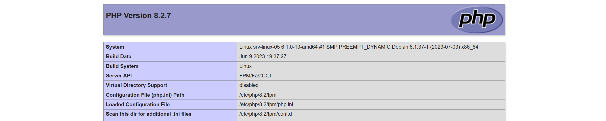
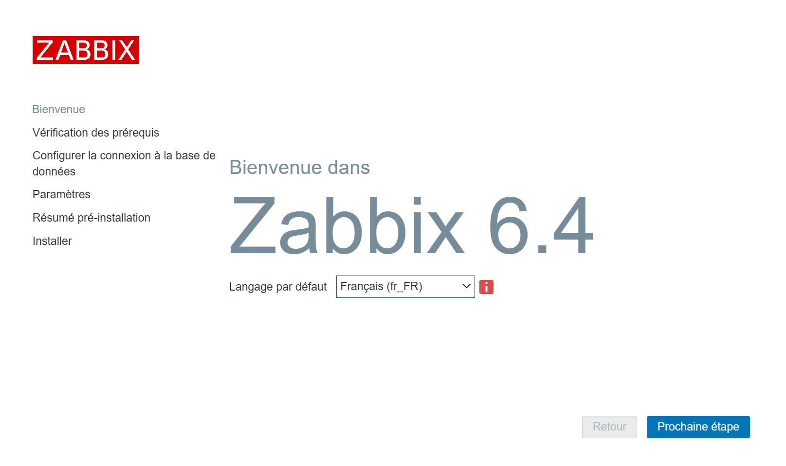
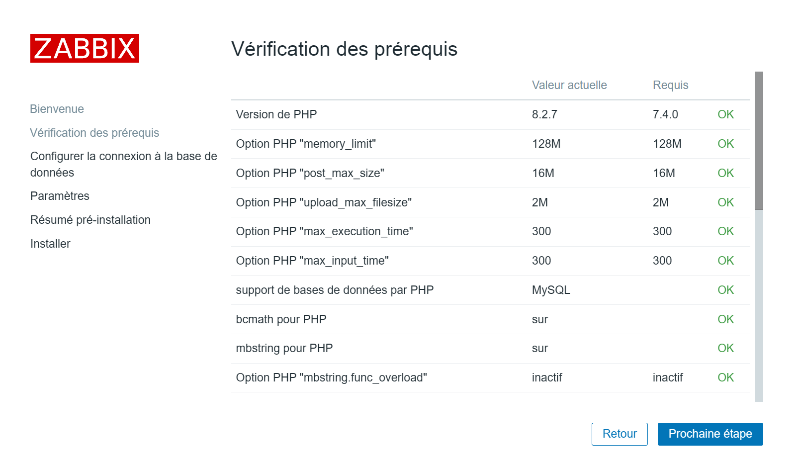
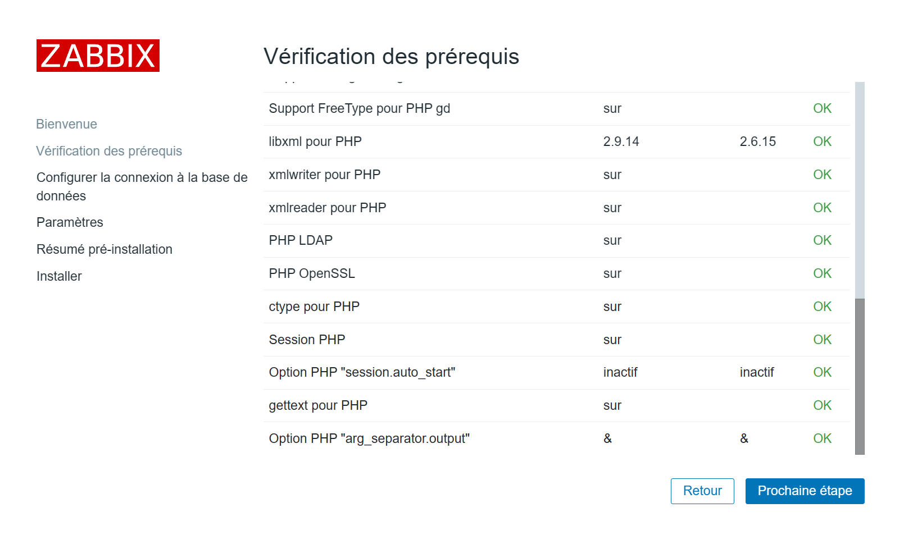
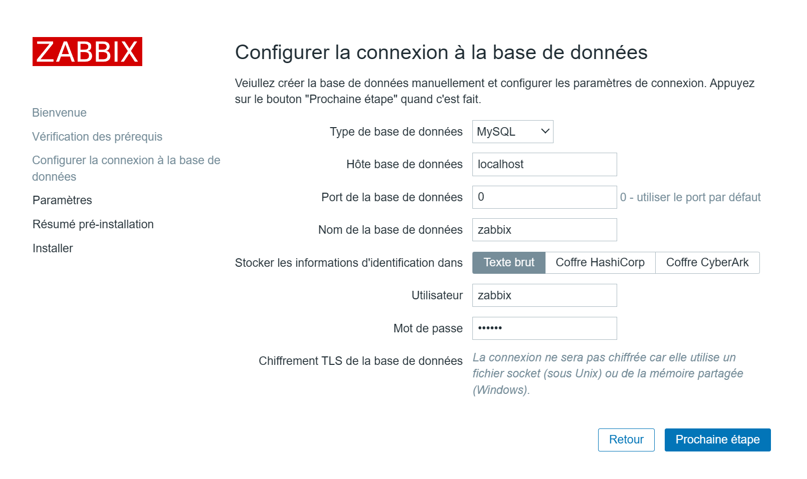
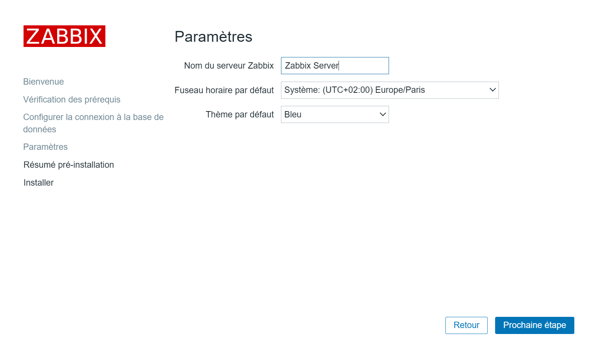
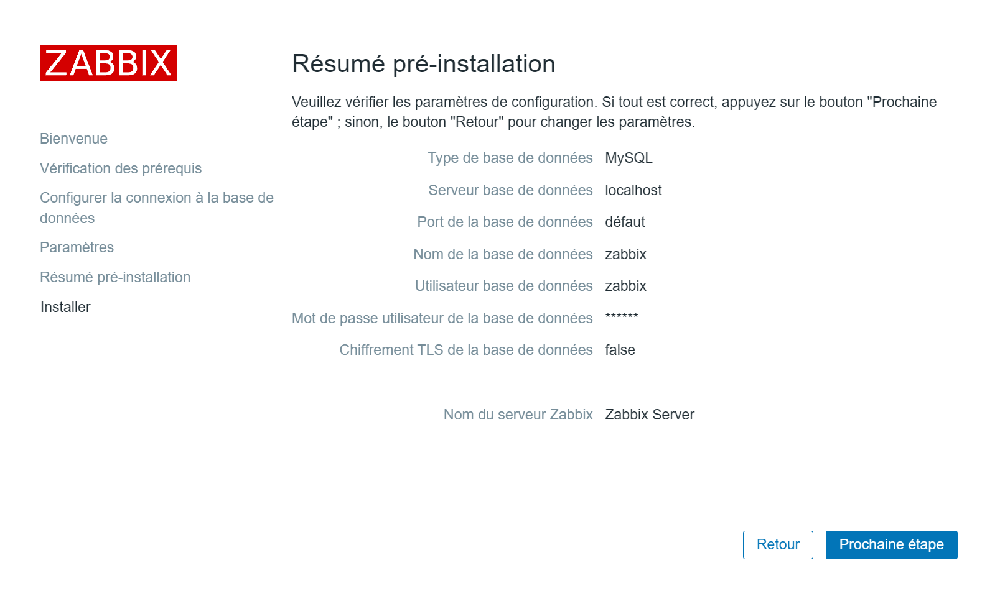
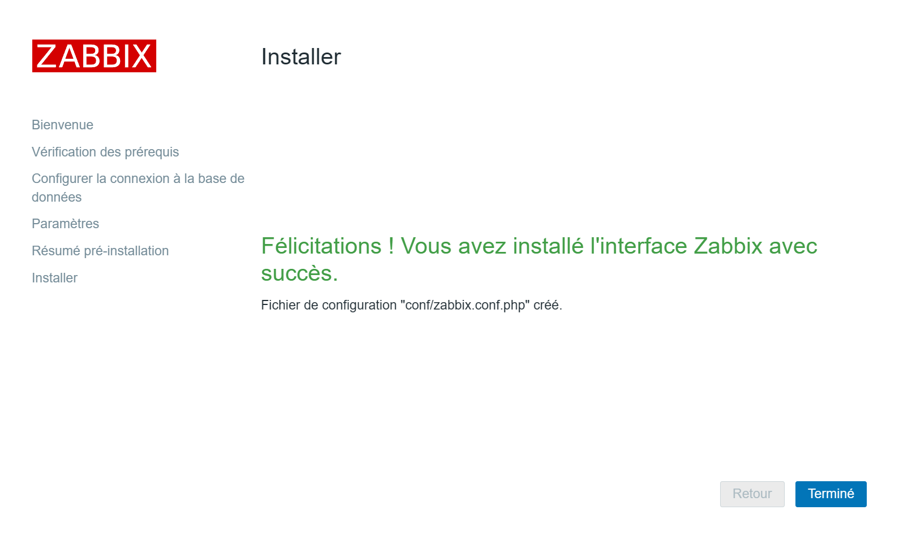
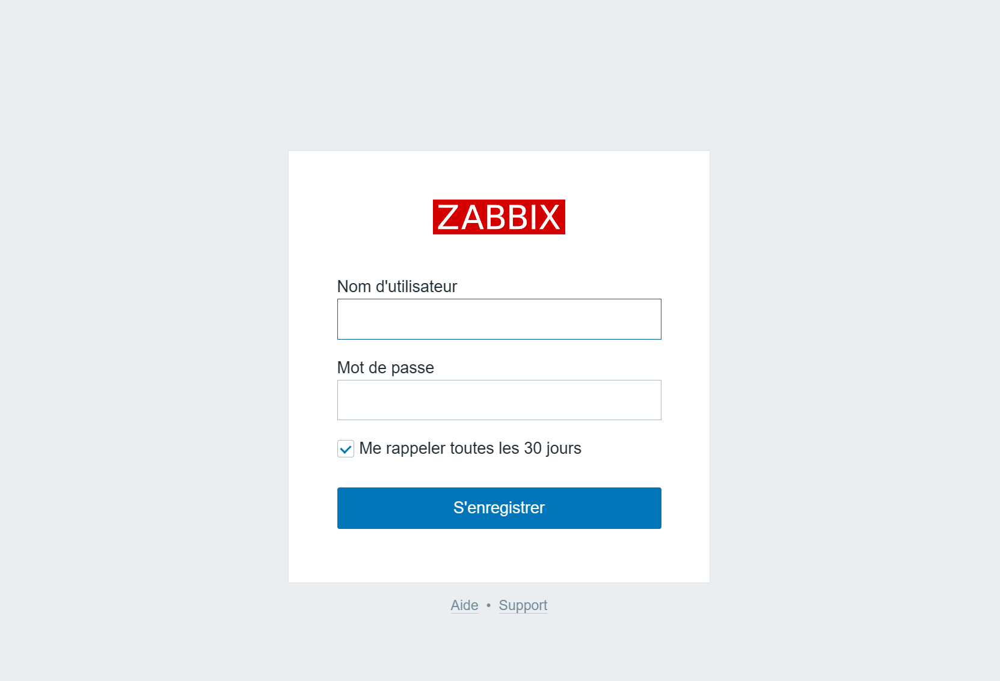
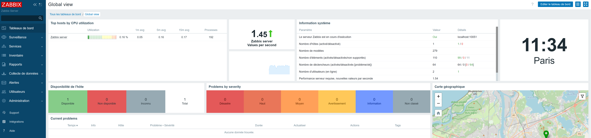

# - B2. Installation ZABBIX 6.4.4 + LAMP + DEBIAN 12 + zabbix-agent2.

## Sommaire :

Prérequis :

Mise à jour du système :
```
apt update && apt upgrade -y
```
Commençons par installer notre serveur LAMP.

| Cat | Etapes |
|------|------| 
| - A. | [Installer apache2.](#balise_01) |
| - a1.| [Exemple pour la création de deux virtualhosts HTTP & HTTPS apache2.](https://github.com/0xCyberLiTech/Apache2/blob/main/Exemple_create_VirtualHost.md) |
| - B. | [Installer PHP.](#balise_02) |
| - C. | [Installer MySQL (MariaDB)](#balise_03) |
| - D. | [Installer Zabbix dans ça dernière version stable.](#balise_04) |
| - E. | [Configurez et démarrez l'agent Zabbix pour surveiller le serveur Zabbix lui-même..](#balise_05) |

<a name="balise_01"></a>
# Installation du serveur Apache2 :

```
apt -y install apache2
```
```
systemctl start apache2.service
```
```
systemctl enable apache2.service
```
```
systemctl status apache2.service
```
# Installation de PHP :

Pour DEBIAN 12 (Bookworm), la version de PHP est 8.2.
Pour DEBIAN 11 (Bullseye), la version de PHP est 7.4.
```
apt install php
```
<a name="balise_02"></a>
# Installation de PHP-FPM
````
apt -y install php-fpm
````
Ajoutez les paramètres dans Virtualhost que vous souhaitez définir PHP-FPM.
```
nano /etc/apache2/sites-enabled/000-default.conf
```
```
<VirtualHost *:80>
        <FilesMatch \.php$>
                SetHandler "proxy:unix:/var/run/php/php8.2-fpm.sock|fcgi://localhost/"
        </FilesMatch>
```
```
a2enmod proxy_fcgi setenvif
```
```
Considering dependency proxy for proxy_fcgi:
Enabling module proxy.
Enabling module proxy_fcgi.
Module setenvif already enabled
To activate the new configuration, you need to run:
  systemctl restart apache2
```
```
systemctl restart apache2.service
```
```
a2enconf php8.2-fpm
```
```
Enabling conf php8.2-fpm.
To activate the new configuration, you need to run:
  systemctl reload apache2
```
```
systemctl restart php8.2-fpm apache2
```
Créez [phpinfo] dans la racine Web de Virtualhost, vous définissez PHP-FPM et y accédez, alors c'est OK si [FPM/FastCGI] est affiché.
```
echo '<?php phpinfo(); ?>' > /var/www/html/info.php
```
Accéder à l'Url http://mon-ip-local/info.php afin de tester.

On peut constater que le module FPM esy pris en charge.

Server API <--> FPM/FastCGI



C'est Ok pour la prise en charge de FPM, passons à la suite.

<a name="balise_03"></a>
# Installation du serveur MariaDB (MySQL)

Nous devons exécuter la commande comme mentionné ci-dessous :
```
apt -y install mariadb-server
```
```
nano /etc/mysql/mariadb.conf.d/50-server.cnf
```
```
character-set-server  = utf8mb4
collation-server      = utf8mb4_general_ci
```
```
systemctl restart mariadb.service
```
Sécuriser le serveur MariaDB :
```
mysql_secure_installation
```
```
NOTE: RUNNING ALL PARTS OF THIS SCRIPT IS RECOMMENDED FOR ALL MariaDB
      SERVERS IN PRODUCTION USE!  PLEASE READ EACH STEP CAREFULLY!

In order to log into MariaDB to secure it, we'll need the current
password for the root user. If you've just installed MariaDB, and
haven't set the root password yet, you should just press enter here.

Enter current password for root (enter for none):
OK, successfully used password, moving on...

Setting the root password or using the unix_socket ensures that nobody
can log into the MariaDB root user without the proper authorisation.

You already have your root account protected, so you can safely answer 'n'.

Switch to unix_socket authentication [Y/n] Y
Enabled successfully!
Reloading privilege tables..
 ... Success!


You already have your root account protected, so you can safely answer 'n'.

Change the root password? [Y/n] Y
New password:
Re-enter new password:
Password updated successfully!
Reloading privilege tables..
 ... Success!


By default, a MariaDB installation has an anonymous user, allowing anyone
to log into MariaDB without having to have a user account created for
them.  This is intended only for testing, and to make the installation
go a bit smoother.  You should remove them before moving into a
production environment.

Remove anonymous users? [Y/n] Y
 ... Success!

Normally, root should only be allowed to connect from 'localhost'.  This
ensures that someone cannot guess at the root password from the network.

Disallow root login remotely? [Y/n] Y
 ... Success!

By default, MariaDB comes with a database named 'test' that anyone can
access.  This is also intended only for testing, and should be removed
before moving into a production environment.

Remove test database and access to it? [Y/n] Y
 - Dropping test database...
 ... Success!
 - Removing privileges on test database...
 ... Success!

Reloading the privilege tables will ensure that all changes made so far
will take effect immediately.

Reload privilege tables now? [Y/n] Y
 ... Success!

Cleaning up...

All done!  If you've completed all of the above steps, your MariaDB
installation should now be secure.

Thanks for using MariaDB!

```
```
systemctl restart mariadb.service
```
Se connecter à MySQL :
```
mysql
```
- [Unix_Socket] authentication is enabled by default :
```
MariaDB [(none)]> show grants for root@localhost;
```
```
+---------------------------------------------------------------------------------------------------------------------------------------------------------------------------+
| Grants for root@localhost                                                                                                                                                 |
+---------------------------------------------------------------------------------------------------------------------------------------------------------------------------+
| GRANT ALL PRIVILEGES ON *.* TO `root`@`localhost` IDENTIFIED VIA mysql_native_password USING '*2538008A2BB77A6ACB52279941975854BA874015' OR unix_socket WITH GRANT OPTION |
| GRANT PROXY ON ''@'%' TO 'root'@'localhost' WITH GRANT OPTION                                                                                                             |
+---------------------------------------------------------------------------------------------------------------------------------------------------------------------------+
2 rows in set (0,000 sec)
```
- Show user list :
```
MariaDB [(none)]> select user,host,password from mysql.user; 
```
```
+-------------+-----------+-------------------------------------------+
| User        | Host      | Password                                  |
+-------------+-----------+-------------------------------------------+
| mariadb.sys | localhost |                                           |
| root        | localhost | *2538008A2BB77A6ACB52279941975854BA874015 |
| mysql       | localhost | invalid                                   |
+-------------+-----------+-------------------------------------------+
3 rows in set (0,001 sec)
```
- Show database list :
```
MariaDB [(none)]> show databases;
```
```
+--------------------+
| Database           |
+--------------------+
| information_schema |
| mysql              |
| performance_schema |
| sys                |
+--------------------+
4 rows in set (0,000 sec)
```
# Create test database :
```
MariaDB [(none)]> create database test_database; 
Query OK, 1 row affected (0.000 sec)
```
- Create test table on test database :
```
MariaDB [(none)]> create table test_database.test_table (id int, name varchar(50), address varchar(50), primary key (id)); 
Query OK, 0 rows affected (0.108 sec)
```
- Insert data to test table :
```
MariaDB [(none)]> insert into test_database.test_table(id, name, address) values("001", "Debian", "Hiroshima"); 
Query OK, 1 row affected (0.036 sec)
```
- Show test table :
```
MariaDB [(none)]> select * from test_database.test_table;
```
```
+----+--------+-----------+
| id | name   | address   |
+----+--------+-----------+
|  1 | Debian | Hiroshima |
+----+--------+-----------+
1 row in set (0.000 sec)
```
- Delete test database :
```
MariaDB [(none)]> drop database test_database; 
Query OK, 1 row affected (0.111 sec)
```
```
MariaDB [(none)]> exit;
```
```
Bye
```
Si vous souhaitez supprimer toutes les données de MariaDB et l'initialiser, exécutez comme suit.
```
systemctl stop mariadb
```
```
rm -rf /var/lib/mysql/*
```
```
mysql_install_db --datadir=/var/lib/mysql --user=mysql
```
```
systemctl start mariadb
```
<a name="balise_04"></a>
# Installer Zabbix dans ça dernière version stable.

Ajoutez les dépôts pour Zabbix 6.4 et installez le serveur Zabbix.

Suivre la version des derniers dépôts : http://repo.zabbix.com/zabbix/6.4/debian/pool/main/z/

Pour surveiller Zabbix lui-même, installez également l'agent Zabbix (zabbix-agent2).
```
wget http://repo.zabbix.com/zabbix/6.4/debian/pool/main/z/zabbix-release/zabbix-release_6.4-1+debian12_all.deb
```
```
ls -l
```
```
zabbix-release_6.4-1+debian12_all.deb
```
```
dpkg -i zabbix-release_6.4-1+debian12_all.deb
```
```
cat /etc/apt/sources.list.d/zabbix.list
```
```
# Zabbix main repository
deb https://repo.zabbix.com/zabbix/6.4/debian bookworm main
deb-src https://repo.zabbix.com/zabbix/6.4/debian bookworm main

# Zabbix unstable repository
#deb https://repo.zabbix.com/zabbix/6.3/debian bookworm main
#deb-src https://repo.zabbix.com/zabbix/6.3/debian bookworm main
```
```
apt update
```
```
apt -y install zabbix-server-mysql zabbix-frontend-php zabbix-apache-conf zabbix-sql-scripts zabbix-agent2 php-mysql php-gd php-bcmath php-net-socket
```
Créez une base de données nommée zabbix.
```
mysql
```
```
MariaDB [(none)]> create database zabbix character set utf8mb4 collate utf8mb4_bin;
```
Remplacez le [mot de passe] par le mot de passe de votre choix :
```
MariaDB [(none)]> grant all privileges on zabbix.* to zabbix@'localhost' identified by 'zabbix2';
```
```
MariaDB [(none)]> set global log_bin_trust_function_creators = 1;
```
```
MariaDB [(none)]> exit;
```
```
zcat /usr/share/zabbix-sql-scripts/mysql/server.sql.gz | mysql -uzabbix -p zabbix
```
le mot de passe que vous avez défini ci-dessus pour l'utilisateur [zabbix2]
```
Configure and start Zabbix Server.
```
```
nano /etc/zabbix/zabbix_server.conf
```
```
DBName=zabbix
```
```
DBUser=zabbix
```
```
DBPassword=zabbix
```
```
systemctl restart zabbix-server.service
```
```
systemctl enable zabbix-server.service
```
<a name="balise_05"></a>
# Configurez et démarrez l'agent Zabbix pour surveiller le serveur Zabbix lui-même.
```
nano /etc/zabbix/zabbix_agent2.conf
```
```
Server=127.0.0.1
```
```
ServerActive=127.0.0.1
```
```
Hostname=Zabbix server
```
```
systemctl restart zabbix-agent2.service
```
Modifiez les valeurs PHP pour les exigences Zabbix.
```
nano /etc/php/8.2/fpm/pool.d/www.conf
```
```
# add to the end
php_value[max_execution_time] = 300
php_value[memory_limit] = 128M
php_value[post_max_size] = 16M
php_value[upload_max_filesize] = 2M
php_value[max_input_time] = 300
php_value[max_input_vars] = 10000
php_value[always_populate_raw_post_data] = -1
php_value[date.timezone] = Europe/Paris
```
```
nano /etc/apache2/conf-enabled/zabbix.conf
```
```
# Define /zabbix alias, this is the default
<IfModule mod_alias.c>
    Alias /zabbix /usr/share/zabbix
</IfModule>

<Directory "/usr/share/zabbix">
    Options FollowSymLinks
    AllowOverride None
    Order allow,deny
    Allow from all

    <IfModule mod_php.c>
        php_value max_execution_time 300
        php_value memory_limit 128M
        php_value post_max_size 16M
        php_value upload_max_filesize 2M
        php_value max_input_time 300
        php_value max_input_vars 10000
        php_value always_populate_raw_post_data -1
        php_value date.timezone Europe/Paris
    </IfModule>

    <IfModule mod_php7.c>
        php_value max_execution_time 300
        php_value memory_limit 128M
        php_value post_max_size 16M
        php_value upload_max_filesize 2M
        php_value max_input_time 300
        php_value max_input_vars 10000
        php_value always_populate_raw_post_data -1
        php_value[date.timezone] = Europe/Paris
    </IfModule>
</Directory>

<Directory "/usr/share/zabbix/conf">
    Order deny,allow
    Deny from all
    <files *.php>
        Order deny,allow
        Deny from all
    </files>
</Directory>

<Directory "/usr/share/zabbix/app">
    Order deny,allow
    Deny from all
    <files *.php>
        Order deny,allow
        Deny from all
    </files>
</Directory>

<Directory "/usr/share/zabbix/include">
    Order deny,allow
    Deny from all
    <files *.php>
        Order deny,allow
        Deny from all
    </files>
</Directory>

<Directory "/usr/share/zabbix/local">
    Order deny,allow
    Deny from all
    <files *.php>
        Order deny,allow
        Deny from all
    </files>
</Directory>

<Directory "/usr/share/zabbix/vendor">
    Order deny,allow
    Deny from all
    <files *.php>
        Order deny,allow
        Deny from all
    </files>
</Directory>
```
```
systemctl restart apache2 php8.2-fpm
```
```
systemctl restart zabbix-server zabbix-agent2 apache2
```
```
systemctl enable zabbix-server zabbix-agent2 apache2
```
Info pour la consultation des logs de l'agent zabbix :

```
tail -100f /var/log/zabbix/zabbix_agent2.log
```

Se rendre vers http://mon-ip-local/zabbix :

Nous allon finaliser cette installation depuis notre navigateur :

Phase 01 :



Phase 02 :



Phase 03 :



Phase 04 :



Phase 05 :



Phase 06 :



Phase 07 :



Phase 08 :



Phase 09 :


