

    
  
  
  
    

  <h2>Laboratoire numérique pour la cybersécurité, Linux & IT</h2>

  

    
    
    
    
    
    
  

<!--
Optimisation SEO : mots-clés Zabbix, 0xCyberLiTech, supervision informatique, monitoring, Zabbix, administration système, sécurité informatique, Linux, Debian, tutoriels supervision, guides monitoring, alertes réseau, performance réseau, open source, ressources techniques, IT, professionnels, étudiants, passionnés, gestion d’infrastructure, surveillance réseau, outils de supervision.
-->

  

  

    <strong>Cybersécurité</strong>  • <strong>Linux Debian</strong>  • <strong>Sécurité informatique</strong> 
  

---

## 🚀 À propos & Objectifs

Ce projet propose des solutions innovantes et accessibles en cybersécurité, avec une approche centrée sur la simplicité d’utilisation et l’efficacité. Il vise à accompagner les utilisateurs dans la protection de leurs données et systèmes, tout en favorisant l’apprentissage et le partage des connaissances.

Le contenu est structuré, accessible et optimisé SEO pour répondre aux besoins de :
- 🎓 Étudiants : approfondir les connaissances
- 👨‍💻 Professionnels IT : outils et pratiques
- 🖥️ Administrateurs système : sécuriser l’infrastructure
- 🛡️ Experts cybersécurité : ressources techniques
- 🚀 Passionnés du numérique : explorer les bonnes pratiques

---

## ZABBIX - Création de base d'un tableau de bord sur Grafana :

Dans cette section, je vais vous montrer comment créer un tableau de bord Grafana de base en utilisant Zabbix comme source de données pour surveiller la vitesse de téléchargement et de téléchargement réseau du serveur Zabbix.

Pour créer un nouveau tableau de bord Grafana, cliquez sur Tableaux de bord > Gérer à partir de l’interface Web de Grafana.

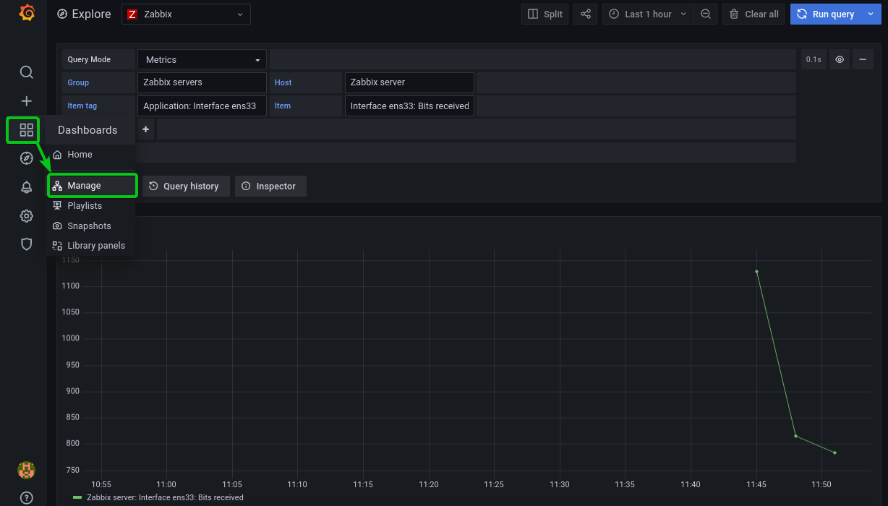

Cliquez sur Nouveau tableau de bord.

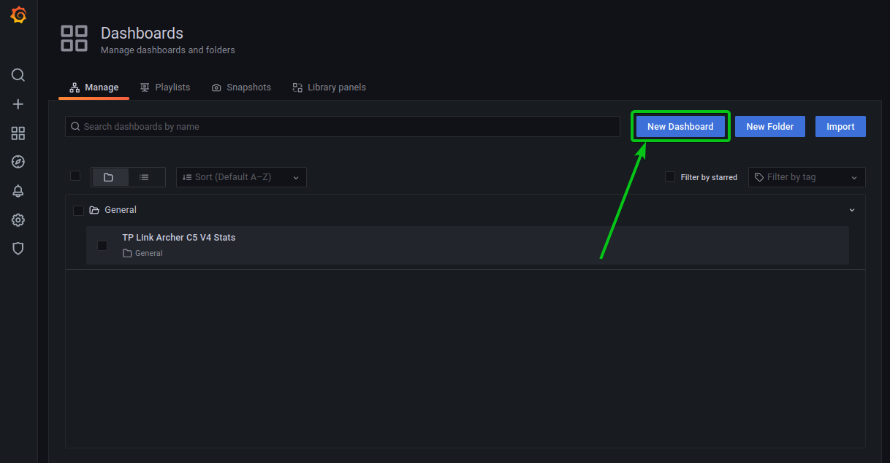

Un nouveau tableau de bord doit être créé.

Cliquez sur Ajouter un panneau vide pour ajouter un nouveau panneau au tableau de bord.

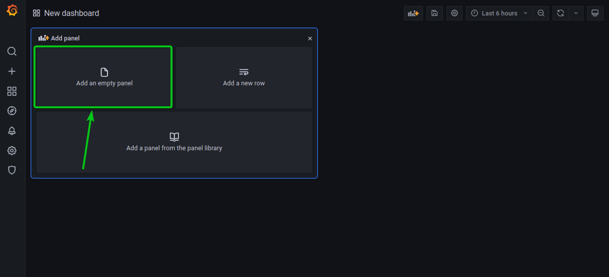

L’éditeur de panneau Grafana doit s’afficher. Vous pouvez configurer votre panneau Grafana à partir d’ici.

Tout d’abord, changez la source de données en Zabbix à partir du menu déroulant Source de données comme indiqué dans la capture d’écran ci-dessous.

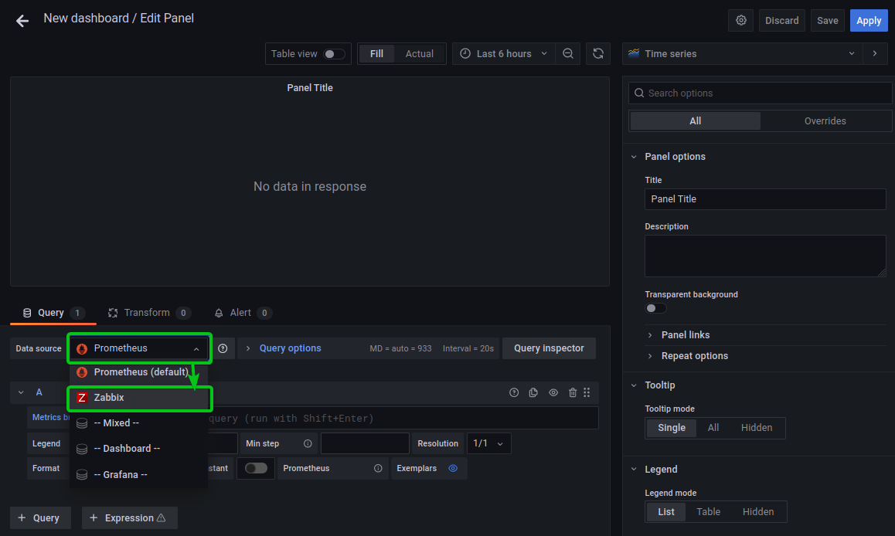

Pour surveiller la vitesse de téléchargement de votre serveur Zabbix, sélectionnez les paramètres de requête indiqués dans la capture d’écran ci-dessous.

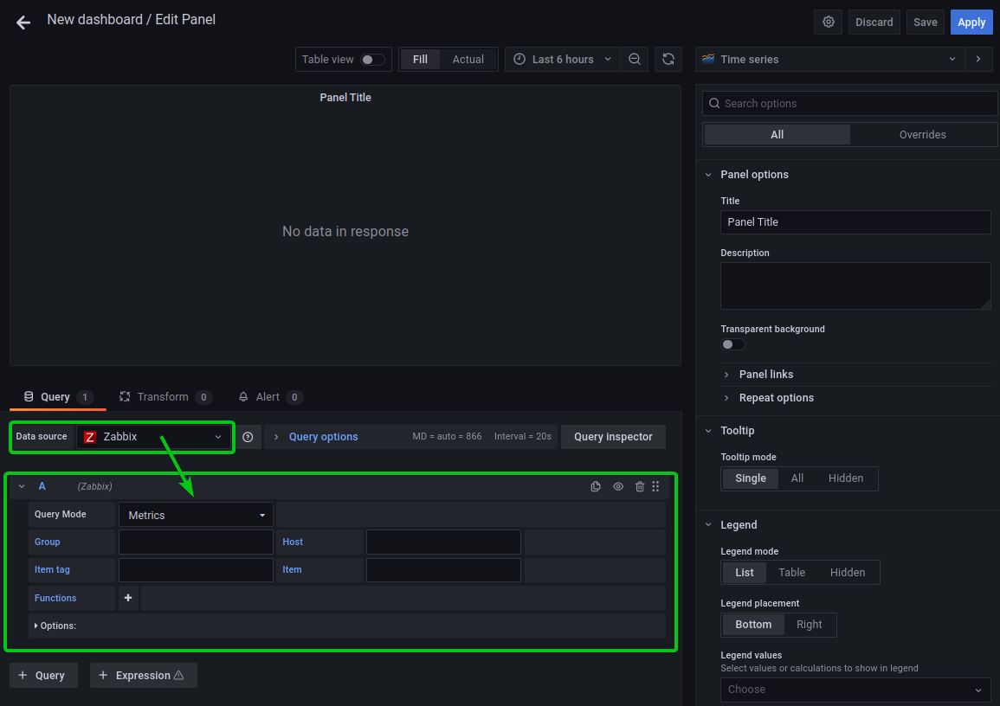

Tapez le titre Vitesse de téléchargement dans la section Titre comme indiqué dans la capture d’écran ci-dessous.

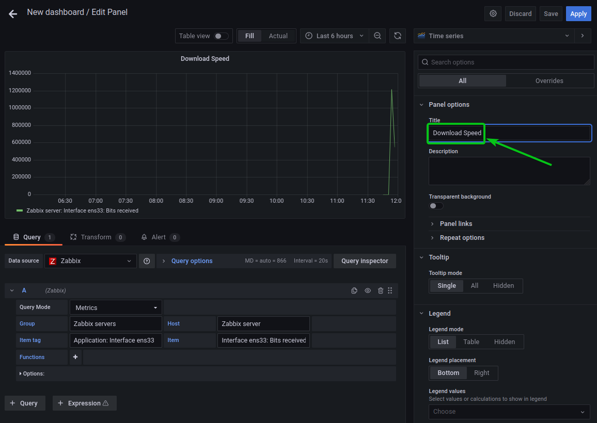

Sélectionnez l’unité Données / bits (IEC) dans la section Unité comme indiqué dans la capture d’écran ci-dessous.

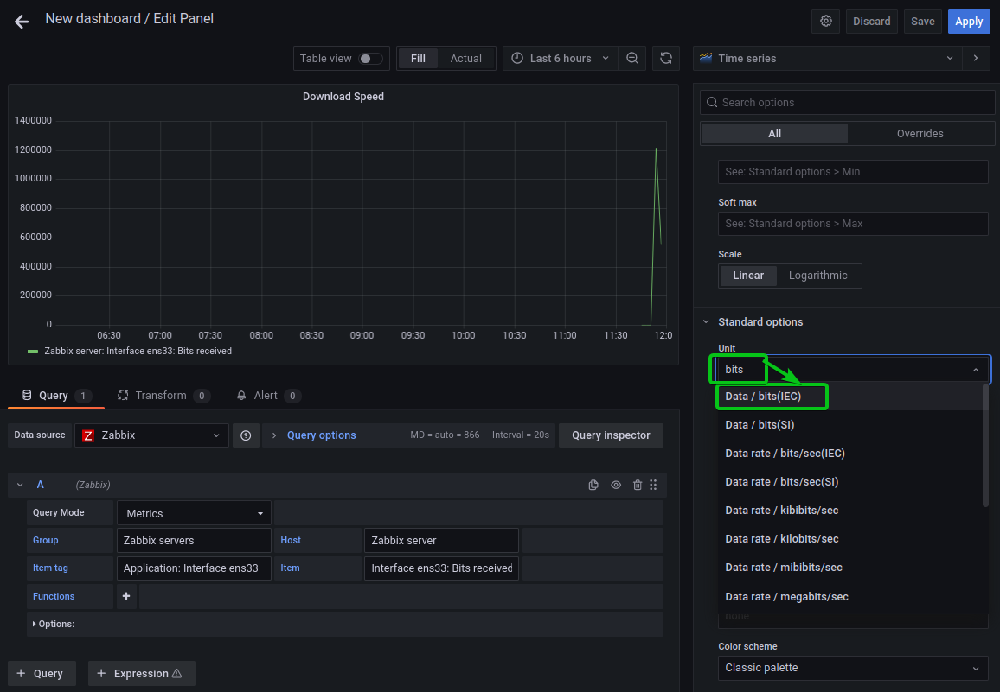

Le graphique de vitesse de téléchargement devrait afficher l’unité de données correcte comme vous pouvez le voir dans la capture d’écran ci-dessous.

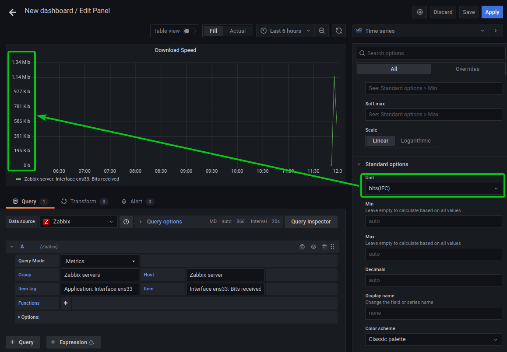

Vous pouvez effectuer de nombreuses personnalisations sur votre panneau Grafana. Vous pouvez lire l’article Comment connecter Grafana avec Prometheus? pour en savoir plus.

Une fois que vous êtes satisfait du résultat, cliquez sur Appliquer pour ajouter le panneau au tableau de bord.

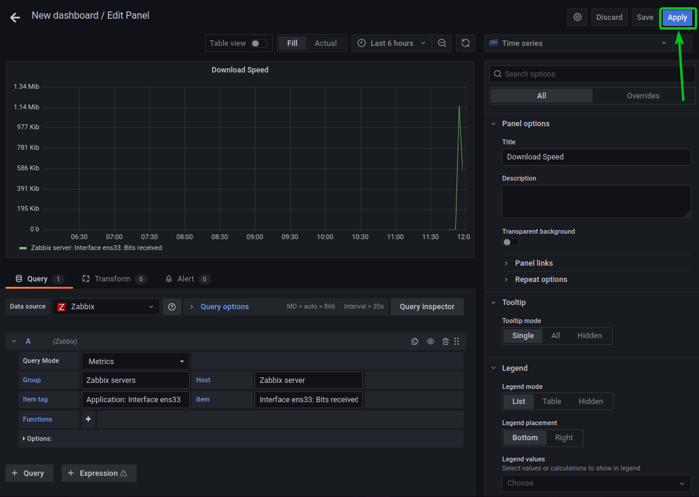

Le panneau Vitesse de téléchargement doit être ajouté au tableau de bord.

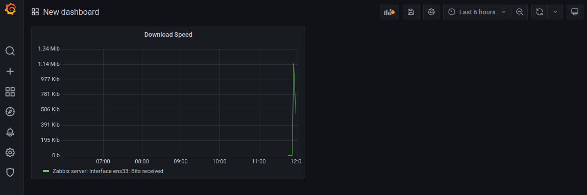

Maintenant, créons un autre panneau pour surveiller la vitesse de téléchargement du serveur Zabbix.

Comme le panneau de surveillance de la vitesse de téléchargement sera le même que le panneau Vitesse de téléchargement, vous pouvez le cloner et modifier quelques paramètres pour surveiller facilement la vitesse de téléchargement de votre serveur Zabbix.

Pour cloner le panneau Vitesse de téléchargement, cliquez sur la flèche vers le bas du panneau et cliquez sur Plus... > Dupliquer comme indiqué dans la capture d’écran ci-dessous.

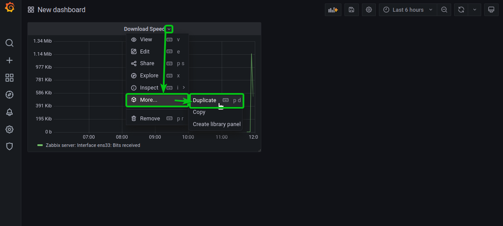

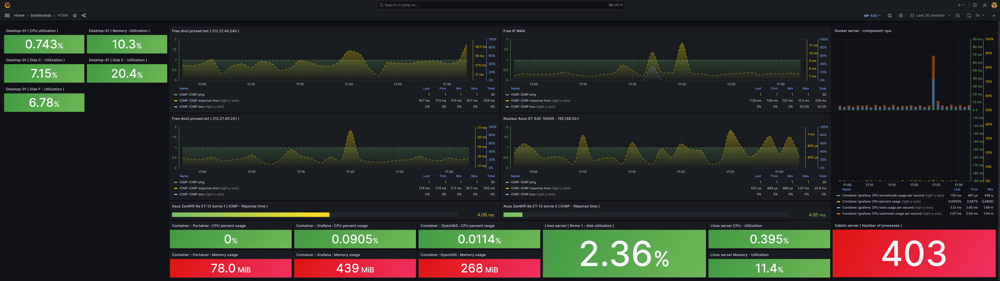

---

  

  <b>🔒 Un guide proposé par <a href="https://github.com/0xCyberLiTech">0xCyberLiTech</a> • Pour des tutoriels accessibles à tous. 🔒</b>

