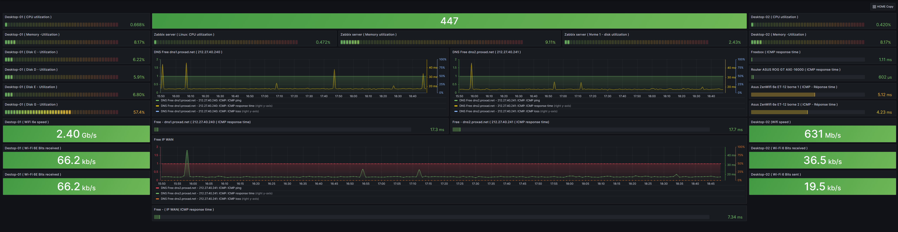

# ZABBIX - Création de base d'un tableau de bord sur Grafana :

Dans cette section, je vais vous montrer comment créer un tableau de bord Grafana de base en utilisant Zabbix comme source de données pour surveiller la vitesse de téléchargement et de téléchargement réseau du serveur Zabbix.

Pour créer un nouveau tableau de bord Grafana, cliquez sur Tableaux de bord > Gérer à partir de l’interface Web de Grafana.

Cliquez sur Nouveau tableau de bord.

Un nouveau tableau de bord doit être créé.

Cliquez sur Ajouter un panneau vide pour ajouter un nouveau panneau au tableau de bord.

L’éditeur de panneau Grafana doit s’afficher. Vous pouvez configurer votre panneau Grafana à partir d’ici.

Tout d’abord, changez la source de données en Zabbix à partir du menu déroulant Source de données comme indiqué dans la capture d’écran ci-dessous.

Pour surveiller la vitesse de téléchargement de votre serveur Zabbix, sélectionnez les paramètres de requête indiqués dans la capture d’écran ci-dessous.

