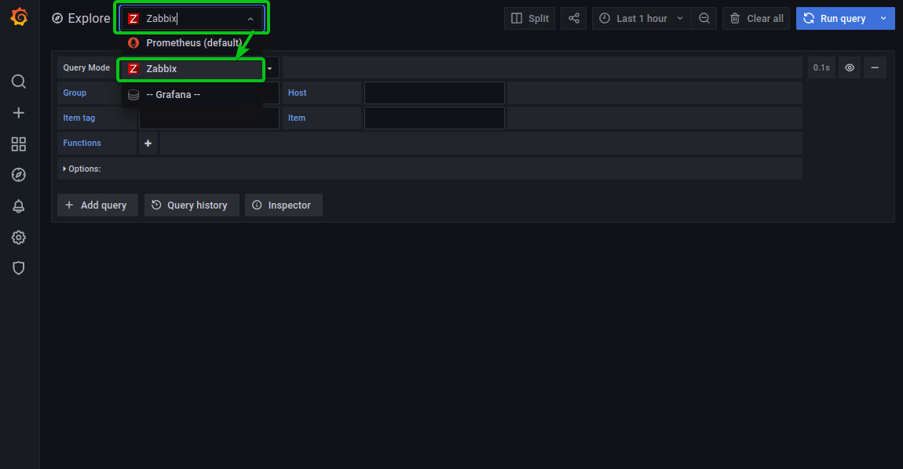
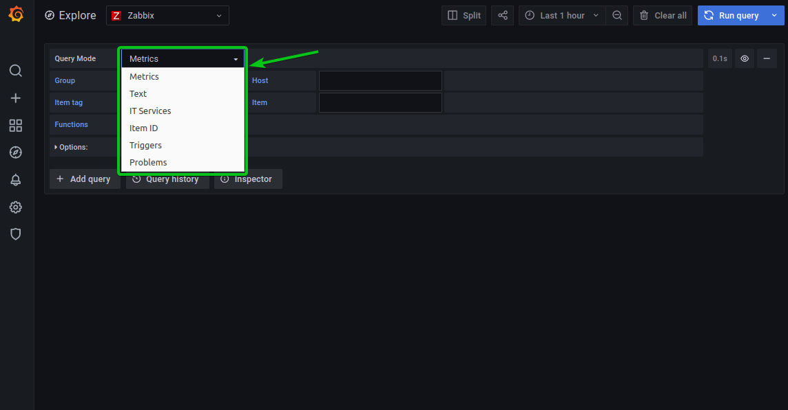
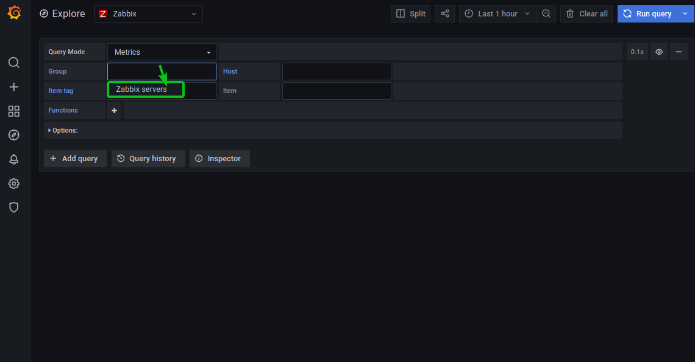
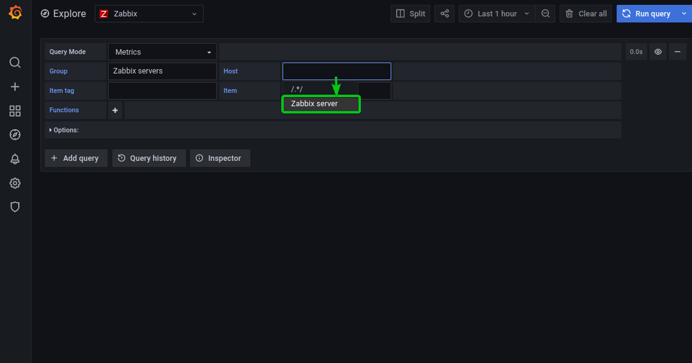
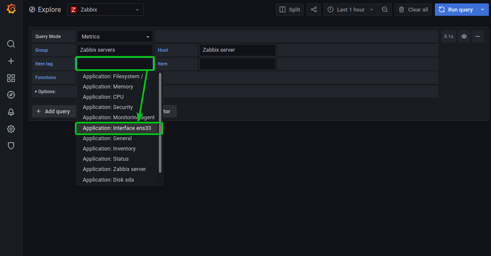
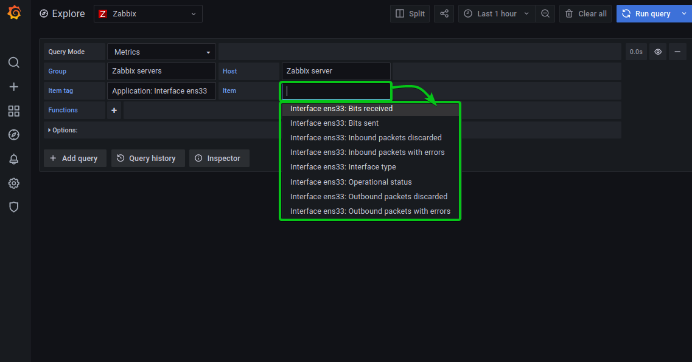
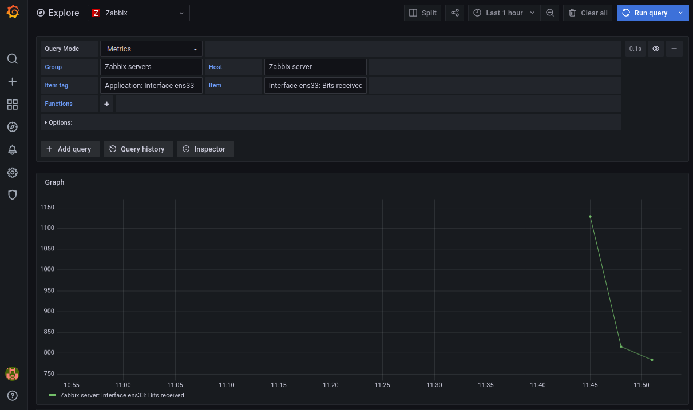

<div align="center">

  <br></br>
  
  <a href="https://github.com/0xCyberLiTech">
    
  </a>
  
  <br></br>

  <h2>Laboratoire numérique pour la cybersécurité, Linux & IT</h2>

  <p align="center">
    <a href="https://0xcyberlitech.github.io/">
      
    </a>
    <a href="https://github.com/0xCyberLiTech">
      
    </a>
    <a href="https://github.com/0xCyberLiTech/Zabbix/releases/latest">
      
    </a>
    <a href="https://github.com/0xCyberLiTech/Zabbix/blob/main/CHANGELOG.md">
      
    </a>
    <a href="https://github.com/0xCyberLiTech?tab=repositories">
      
    </a>
    <a href="https://github.com/0xCyberLiTech/Zabbix/graphs/contributors">
      
    </a>
  </p>

</div>

<!--
Optimisation SEO : mots-clés Zabbix, 0xCyberLiTech, supervision informatique, monitoring, Zabbix, administration système, sécurité informatique, Linux, Debian, tutoriels supervision, guides monitoring, alertes réseau, performance réseau, open source, ressources techniques, IT, professionnels, étudiants, passionnés, gestion d’infrastructure, surveillance réseau, outils de supervision.
-->

<div align="center">
  
</div>

<div align="center">
  <p>
    <strong>Cybersécurité</strong>  • <strong>Linux Debian</strong>  • <strong>Sécurité informatique</strong> 
  </p>
</div>

---

## 🚀 À propos & Objectifs

Ce projet propose des solutions innovantes et accessibles en cybersécurité, avec une approche centrée sur la simplicité d’utilisation et l’efficacité. Il vise à accompagner les utilisateurs dans la protection de leurs données et systèmes, tout en favorisant l’apprentissage et le partage des connaissances.

Le contenu est structuré, accessible et optimisé SEO pour répondre aux besoins de :
- 🎓 Étudiants : approfondir les connaissances
- 👨‍💻 Professionnels IT : outils et pratiques
- 🖥️ Administrateurs système : sécuriser l’infrastructure
- 🛡️ Experts cybersécurité : ressources techniques
- 🚀 Passionnés du numérique : explorer les bonnes pratiques

---

## ZABBIX - Surveillance avec Grafana :

Pour tester si vous pouvez surveiller Zabbix avec Grafana, cliquez sur l’icône Explorer de Grafana comme indiqué dans la capture d’écran ci-dessous.


Sélectionnez Zabbix dans le menu déroulant Explorer comme indiqué dans la capture d’écran ci-dessous.



Maintenant, sélectionnez le type de données que vous souhaitez interroger à partir de Zabbix dans le menu déroulant Mode de requête, comme indiqué dans la capture d’écran ci-dessous.

Je vais sélectionner le type de métriques.



Sélectionnez le groupe Zabbix souhaité dans la section Groupe. Je vais sélectionner le groupe de serveurs Zabbix par défaut.



Sélectionnez votre hôte Zabbix dans la section Hôte. Je vais sélectionner l’hôte du serveur Zabbix.



Sélectionnez une balise d’élément que vous souhaitez surveiller dans la section Balise d’élément.

Je vais sélectionner la balise item Application: Interface ens33 dans cet exemple.

Cette balise item vous permettra de surveiller l’interface réseau ens33.



Maintenant, sélectionnez l’élément que vous souhaitez surveiller dans la section Élément.

Si vous avez sélectionné l’Application de balise Item : Interface ens33 comme je l’ai fait, vous pouvez sélectionner l’Interface Item ens33: Bit received pour surveiller la vitesse de téléchargement de l’interface réseau ens33.



Vous devriez voir un graphique de la vitesse de téléchargement de l’interface réseau ens33.



Concernat les règles de firewall (UFW) :

```
[ 1] 80/tcp                     ALLOW IN    192.168.50.0/24
[ 2] 443/tcp                    ALLOW IN    192.168.50.0/24
[ 3] 2234/tcp                   ALLOW IN    192.168.50.0/24
[ 4] 10050/tcp                  ALLOW IN    192.168.50.0/24
[ 5] 9443/tcp                   ALLOW IN    192.168.50.0/24
[ 6] 9392/tcp                   ALLOW IN    192.168.0.0/16
[ 7] 8181/tcp                   ALLOW IN    192.168.50.0/24
[ 8] 8585/tcp                   ALLOW IN    192.168.50.0/24
[ 9] 8086/tcp                   ALLOW IN    192.168.50.0/24
[10] 1883/tcp                   ALLOW IN    192.168.50.0/24
[11] 25/tcp                     ALLOW IN    192.168.50.0/24
[12] Anywhere                   ALLOW IN    172.21.0.0/16
[13] Anywhere                   ALLOW IN    172.22.0.0/16
[14] 3000/tcp                   ALLOW IN    192.168.0.0/16

```
Il faut ouvrir le port 3000 pourGrafana, mais cela ne suffit pas si Grafana est installé dans un container.
```
[12] Anywhere                   ALLOW IN    172.21.0.0/16 # Docker
[13] Anywhere                   ALLOW IN    172.22.0.0/16 # Docker
```

---

<div align="center">
  <a href="https://github.com/0xCyberLiTech" target="_blank" rel="noopener">
    
  </a>
</div>

<p align="center">
  <b>🔒 Un guide proposé par <a href="https://github.com/0xCyberLiTech">0xCyberLiTech</a> • Pour des tutoriels accessibles à tous. 🔒</b>
</p>
