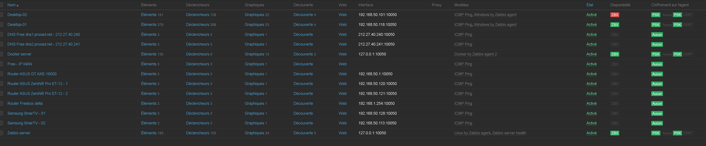
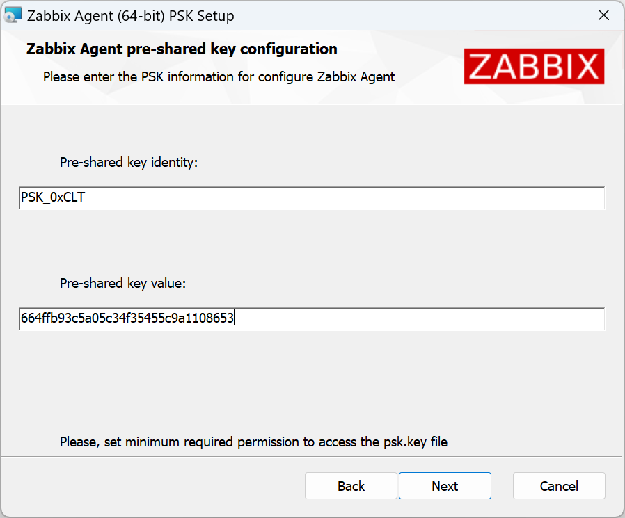

# ZABBIX Sécurisation de la communication entre l'agent-ZABBIX et le serveur.

Génération de la clé PSK.

Tout d'abord installer le paquet gnutls-bin.
```
apt-get install gnutls-bin
```
Par exemple, générer une clé PSK de 256 bits (32 octets).
```
psktool -u PSK_0xCLT -p databasewindows.psk -s 32
```
Par exemple, générer une clé PSK de 128 bits (16 octets).
```
psktool -u PSK_0xCLT -p databasewindows.psk -s 16
```
Un fichier est créé databasewindows.psk, il faudra y récupérer les informations générées.
```
cat databasewindows.psk
```
```
PSK_0xCLT:7670cb2e697889092755fd5a50acb8a16bcf356c5eb6e1e39feb89a391464985
```
Sur cette ligne, on retrouve deux données :
TLSPSKIdentity = PSK_0xCLT
TLSPSKKey = 7670cb2e697889092755fd5a50acb8a16bcf356c5eb6e1e39feb89a391464985

Ces deux données seront nécessaires pour paramétrer l'agent zabbix windows.

1 ) - Intervention sur une machine Windows, déploiement des clés PSK sur l'agent zabbix.

2 ) - Intervention sur une machine Linux, déploiement des clés PSK sur l'agent zabbix.

1 ) - Intervention sur une machine Windows, déploiement des clés PSK sur l'agent zabbix.

[Url ou récupérer les agents pour la version de Zabbix 6.4.x](https://www.zabbix.com/fr/download_agents?version=6.0+LTS&release=6.0.3&os=Linux&os_version=4.12&hardware=ppc64le&encryption=No+encryption&packaging=Archive&show_legacy=0)

Nous installons l'agent. (zabbix_agent-6.4.4-windows-amd64-openssl.msi)

Lors de l'installation de l'agent Zabbix pour Windows, effectuer les réglages, voir captures d'écran ci-dessous :




Depuis le serveur Zabbix effectuer les réglages qui s'imposent :


Il faut se rendre sur l'onglet chiffrement et reproduire les mêmes actions :


On obtient donc le résultat suivant :


2 ) - Intervention sur une machine Linux, déploiement des clés PSK sur l'agent zabbix.

[Url ou récupérer les agents pour la version de Zabbix 6.4.x](https://www.zabbix.com/fr/download_agents?version=6.0+LTS&release=6.0.3&os=Linux&os_version=4.12&hardware=ppc64le&encryption=No+encryption&packaging=Archive&show_legacy=0)

Nous supposons que l'agent zabbix est déja installé.

Nous devons maintenant modifier le fichier de configuration pour indiquer à l’agent où trouver le serveur.

Ouvrez /etc/zabbix/zabbix_agent2.conf dans votre éditeur de texte préféré et apportez les modifications suivantes pour indiquer à l’agent quels serveurs Zabbix sont autorisés à lui communiquer :
```
nano /etc/zabbix/zabbix_agent2.conf
```
Server=[IP or hostname of your Zabbix server]
ServerActive=[IP or hostname of your Zabbix server]

Nous devons également indiquer à Zabbix le nom d’hôte du système.

Il n’est pas nécessaire que ce soit le nom d’hôte réel, c’est le nom d’affichage que nous utiliserons dans Zabbix pour le système.

Commentez la valeur par défaut de Hostname=Zabbix server et remplacez-la par la valeur suivante :
```
HostnameItem=system.hostname
```
Cela indiquera à l’agent de remplir automatiquement la valeur du nom d’hôte avec le nom d’hôte du système.

Vous pouvez simplement définir le nom d’hôte dans le fichier de configuration.

Cependant, le remplissage automatique vous permet de réutiliser le même fichier de configuration sur tous vos hôtes, ce qui simplifie l’automatisation si vous avez beaucoup d’hôtes à surveiller.

Démarrer l’agent 2
```
systemctl enable zabbix-agent2
```
```
systemctl start zabbix-agent2
```
Passons aux clés PSK :

Description :

Par défaut, la communication de l’agent se fait en texte clair.

Pour le cryptage, nous avons la possibilité d’utiliser le cryptage basé sur PSK.

PSK signifie clé pré-partagée.

L’option PSK se compose de deux valeurs importantes, l’identité PSK et le secret PSK.

La clé doit être au minimum axée sur une résolution de 128 bits (PSK de 16 octets, entré sous forme de 32 chiffres hexadécimaux) jusqu’à 2048 bits (PSK de 256 octets, entré sous la forme de 512 chiffres hexadécimaux).

Dans cet exemple, je l’enregistre également directement dans un fichier.

Je crée d’abord un dossier /etc/zabbix/psk_keys/.
```
mkdir -p /etc/zabbix/psk_keys/
```
```
cd /etc/zabbix/psk_keys/
```
Génération de la clé PSK.
```
openssl rand -hex 16 > database.psk
```
Un fichier est créé database.psk.
```
cat database.psk
```
```
764ea037da34ea0bd00994baaa304d64
```
Je m’assure également que seul l’utilisateur Zabbix peut lire le fichier.
```
chown zabbix:zabbix database.psk
```
```
chmod 640 database.psk
```
De plus, je reconfigure ensuite le fichier de configuration de l’agent Zabbix.
```
nano /etc/zabbix/zabbix_agent2.conf
```
Se rendre vers la fin du fichier, apporter les modifications suivantes :
```
####### TLS-RELATED PARAMETERS #######

### Option: TLSConnect
#       How the agent should connect to server or proxy. Used for active checks.
#       Only one value can be specified:
#               unencrypted - connect without encryption
#               psk         - connect using TLS and a pre-shared key
#               cert        - connect using TLS and a certificate
#
# Mandatory: yes, if TLS certificate or PSK parameters are defined (even for 'unencrypted' connection)
# Default:
TLSConnect=psk
```
```
### Option: TLSAccept
#       What incoming connections to accept.
#       Multiple values can be specified, separated by comma:
#               unencrypted - accept connections without encryption
#               psk         - accept connections secured with TLS and a pre-shared key
#               cert        - accept connections secured with TLS and a certificate
#
# Mandatory: yes, if TLS certificate or PSK parameters are defined (even for 'unencrypted' connection)
# Default:
TLSAccept=psk
```
```
### Option: TLSPSKFile
#       Full pathname of a file containing the pre-shared key.
#
# Mandatory: no
# Default:
TLSPSKFile=/etc/zabbix/psk_keys/database.psk
```
```
### Option: TLSPSKIdentity
#       Unique, case sensitive string used to identify the pre-shared key.
#
# Mandatory: no
# Default:
TLSPSKIdentity=pskident
```
Récapitulatif :
```
TLSConnect=psk
TLSAccept=psk
TLSPSKFile=/etc/zabbix/psk_keys/database.psk
TLSPSKIdentity=pskident
```
La valeur TLSPSKIdentity que vous décidez de créer ne sera pas chiffrée lors du transport, n’utilisez donc rien de sensible.

Je redémarre ensuite l’agent.
```
systemctl restart zabbix-agent2.service
```
Je vais ensuite dans l’interface utilisateur du serveur Zabbix et configure les options de cryptage PSK pour l’hôte.

De plus, je sélectionne l’icône.

'Connexions à l’hôte' = PSK

'Connexions depuis l’hôte' = PSK

'PSK Identity' = [tout ce que vous avez utilisé dans la configuration de l’agent Zabbix]

'PSK' = [la longue chaîne hexadécimale générée à partir de la commande OpenSSL ci-dessus]

Après une minute ou deux, le serveur et l’agent Zabbix communiqueront avec succès en utilisant le cryptage PSK.

PSK derrière un proxy :

La configuration du chiffrement PSK sur les agents derrière un proxy n’est pas nécessaire s’ils s’exécutent tous sur le même réseau privé interne, sauf si votre stratégie de sécurité recommande également un certain niveau de chiffrement sur vos réseaux internes.

Ce que vous devez faire en premier à la place, c’est activer PSK pour les communications entre votre serveur Zabbix et Zabbix Proxy.

Vous devez créer un nouveau secret, et ajouter l’identité et le secret PSK à Administration ⇾ Proxies ⇾ [Votre proxy] ⇾ Cryptage et également ajuster les paramètres à l’intérieur du fichier de configuration des proxys dans /etc/zabbix/zabbix_proxy.conf.

Avertissement :

Si vous configurez le chiffrement PSK pour les agents derrière un proxy Zabbix, assurez-vous que Zabbix Server ⇽⇾ Proxy PSK est activé en premier. En effet, lorsque vous démarrez le proxy ou effectuez une config_cache_reload, le proxy télécharge tous ses paramètres d’hôte à partir du serveur, ce qui inclut également la copie du secret par le serveur.

Le proxy doit connaître le secret puisqu’il gère maintenant les communications au nom du serveur.

Si vous voulez un cryptage PSK pour tous les agents derrière un proxy, vous continuez à configurer les agents comme d’habitude en créant un nouveau secret, en y éditant la page Configuration ⇾ Hosts ⇾ [Your Host] ⇾ Encryption, et en éditant également leur propre fichier de configuration dans /etc/zabbix/zabbix_agentd.conf.

N’oubliez pas que, puisque la configuration de votre hôte d’agents dans l’interface utilisateur Zabbix sera définie comme surveillée par proxy, les paramètres PSK seront applicables aux communications entre le proxy Zabbix et l’agent qu’il surveille. Pas entre le serveur Zabbix et l’agent derrière le proxy.

Vous pouvez également ajouter le cryptage PSK entre votre proxy Zabbix et son propre agent local si vous le souhaitez. Vous devez définir ses paramètres PSK dans la configuration de l’hôte des agents proxy dans Configuration ⇾ Hôtes ⇾ [Votre proxy] ⇾ Cryptage, et modifier les paramètres dans les agents sur le fichier de configuration dans /etc/zabbix/zabbix_agentd.conf. N’oubliez pas que cela ne s’applique qu’aux communications entre le proxy Zabbix et son propre processus d’agent.

Lors de la configuration du cryptage PSK pour le serveur, le proxy et les agents Zabbix, vous pouvez voir une erreur dans les journaux du proxy,

cannot send proxy data to server at "zabbix.your-domain.tld": connection of type "TLS with PSK" is not allowed for proxy "your-proxy".

Vérifiez d’abord que les paramètres PSK de votre serveur Zabbix ⇽⇾ proxy sont corrects. Ne confondez pas le processus d’agent optionnel des proxys et son processus proxy principal requis.

Dépannage :

Vérifiez les journaux de l’agent Zabbix à l’adresse.
```
tail -f /var/log/zabbix/zabbix_agent2.log
```
Si tout est OK :
```
2023/08/14 22:24:45.639298 Plugin communication protocol version is 6.4.0
2023/08/14 22:24:45.639317 Zabbix Agent2 hostname: [Zabbix server]
```
