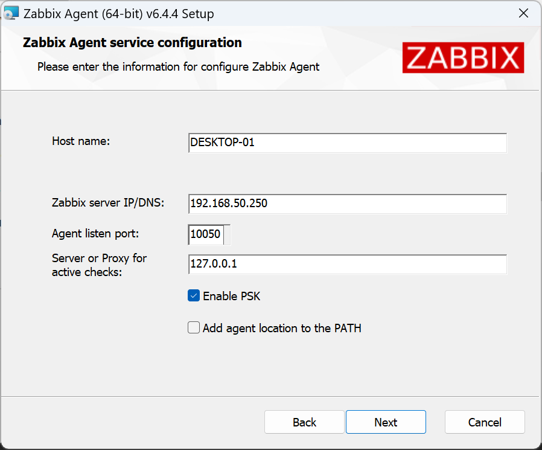
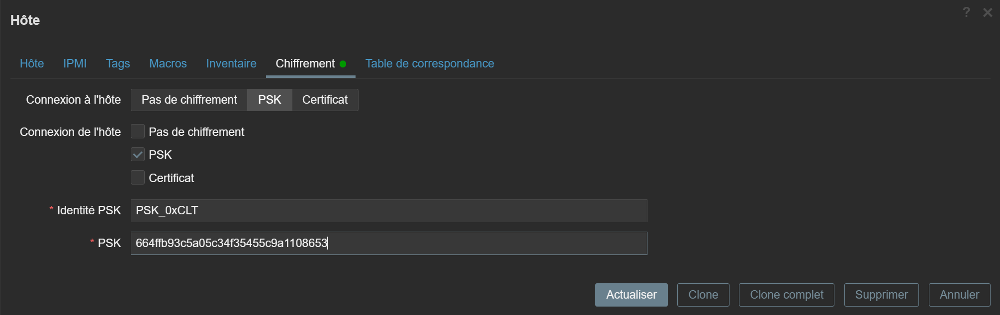

# ZABBIX Sécurisation de la communication entre l'agent-ZABBIX et le serveur.

Génération de la clé PSK.

Tout d'abord installer le paquet gnutls-bin.
```
apt-get install gnutls-bin
```
(GnuTLS :)

Par exemple, générer une clé PSK de 256 bits (32 octets).
```
psktool -u PSK_0xCLT -p database.psk -s 32
```
Un fichier est créé database.psk.
```
cat database.psk
```
```
PSK_0xCLT:7670cb2e697889092755fd5a50acb8a16bcf356c5eb6e1e39feb89a391464985
```
Par exemple, générer une clé PSK de 128 bits (16 octets).

Pour mon exemple, j'ai opté pour une clé en 128 bits.

psktool -u PSK_0xCLT -p database.psk -s 16

Un fichier est créé database.psk.
```
cat database.psk
```
```
PSK_0xCLT:174bf4403d789ca1bf4851dbfee9cd6b
```
1 ) - Nous intervenons sur la machine Windows à surveiller Destop-01 :

Nous installons l'agent. (zabbix_agent-6.4.4-windows-amd64-openssl.msi)

[Url ou récupérer les agents pour la version de Zabbix 6.4.x](https://www.zabbix.com/fr/download_agents?version=6.0+LTS&release=6.0.3&os=Linux&os_version=4.12&hardware=ppc64le&encryption=No+encryption&packaging=Archive&show_legacy=0)

Lors de l'installation de l'agent Zabbix pour Windows, effectuer les réglages, voir captures d'écran ci-dessous :




2) Depuis le serveur Zabbix effectuer les réglages qui s'imposent :


Il faut se rendre sur l'onglet chiffrement et reproduire les mêmes actions :



On obtient donc le résultat suivant :


