## ZABBIX installation depuis DEBIAN 12 (LAMP + Zabbix version 7.2 + zabbix-agent2.

## Sommaire :

Prérequis avant de poursuivre :

- Mise à jour du système.
- Seveur Apache + PHP opérationnel.
- Serveur MySQL opérationnel.
- Serveur de temps NTP opérationnel.

## Voici les étapes suivantes que vous devez réaliser :

- 01 - [Installer un serveur Apache2 fonctionnel de base.](#balise_01)
- 02 - [Créé deux VirtualHosts HTTP & HTTPS.](https://github.com/0xCyberLiTech/Apache2/blob/main/Cr%C3%A9%C3%A9-deux-VirtualHosts-HTTP-HTTPS.md)
- 03 - [Installer PHP & PHP-FPM.](#balise_03) 
- 04 - [Installer MySQL (MariaDB)](#balise_04)
- 05 - [Installer Server, Frontend, Agent 2 ZABBIX dans sa dernière version stable 7.2.](#balise_05)
- 06 - [Installez et configurez l'agent Zabbix 2 pour votre plateforme.](#balise_06)
- 07 - [Infos complémentaires.](#balise_07)

<a name="balise_01"></a>
## 01 - Installer un serveur Apache2 fonctionnel de base :

```
apt -y install apache2
```
```
systemctl start apache2.service
```
```
systemctl enable apache2.service
```
```
systemctl status apache2.service
```
<a name="balise_03"></a>
## 03 - Installer PHP & PHP-FPM :

Pour DEBIAN 12 (Bookworm), la version de PHP est 8.2.
Pour DEBIAN 11 (Bullseye), la version de PHP est 7.4.
```
apt install php
```
## Installer le module PHP-FPM :

A quoi sert ce module PHP-FPM, concrètement ?

PHP-FPM signifie PHP FastCGI Process Manager. Son rôle principal est de gérer l’exécution des scripts PHP sur un serveur web de manière plus rapide, plus efficace et plus sécurisée.

- Améliorer les performances : PHP-FPM lance plusieurs processus PHP en avance, prêts à exécuter des scripts sans délai.
- Mieux gérer la charge : Il répartit intelligemment les requêtes entre les différents processus PHP, ce qui aide quand il y a beaucoup de trafic.
- Configurer plus finement : On peut adapter les réglages (nombre de processus, limites de mémoire, etc.) selon chaque site ou application.

````
apt -y install php-fpm
````
Ajoutez les paramètres dans le ou les Virtualhosts que vous souhaitez associer à PHP-FPM.
```
nano /etc/apache2/sites-enabled/000-default.conf
```
```
<VirtualHost *:80>
        <FilesMatch \.php$>
                SetHandler "proxy:unix:/var/run/php/php8.2-fpm.sock|fcgi://localhost/"
        </FilesMatch>
```
À quoi ça sert ?

➡️ “Pour exécuter les fichiers PHP, envoie-les à PHP-FPM via ce fichier spécial (le socket)”.

🧠 Décomposons :
- proxy:unix:/var/run/php/php8.2-fpm.sock → c’est le chemin du socket utilisé pour parler à PHP-FPM.
- |fcgi://localhost/ → indique qu’on utilise le protocole FastCGI pour communiquer.

```
a2enmod proxy_fcgi setenvif
```
À quoi ça sert ?

Sert à activer deux modules Apache :

- 🧩 proxy_fcgi : permet à Apache de parler avec PHP-FPM (via FastCGI).
- ⚙️ setenvif : permet de définir des variables d’environnement selon la requête (utile pour PHP-FPM aussi).

```
Considering dependency proxy for proxy_fcgi:
Enabling module proxy.
Enabling module proxy_fcgi.
Module setenvif already enabled
To activate the new configuration, you need to run:
  systemctl restart apache2
```
```
systemctl restart apache2.service
```
```
a2enconf php8.2-fpm
```
```
Enabling conf php8.2-fpm.
To activate the new configuration, you need to run:
  systemctl reload apache2
```
```
systemctl restart php8.2-fpm apache2
```
## Test de PHP :

Créez le fichier [info.php] dans la racine du dossier Web, ( /va/www/html/ ).
```
echo '<?php phpinfo(); ?>' > /var/www/html/info.php
```
Accéder à l'Url http://mon-ip-local/info.php afin de tester.
Cette page nous permet d'avoir accès à l'ensemble des informations PHP (version, extensions, config, etc.), peut être très utile.

On peut y constater que le module FPM esy pris en charge.

Serveur API <--> FPM/FastCGI

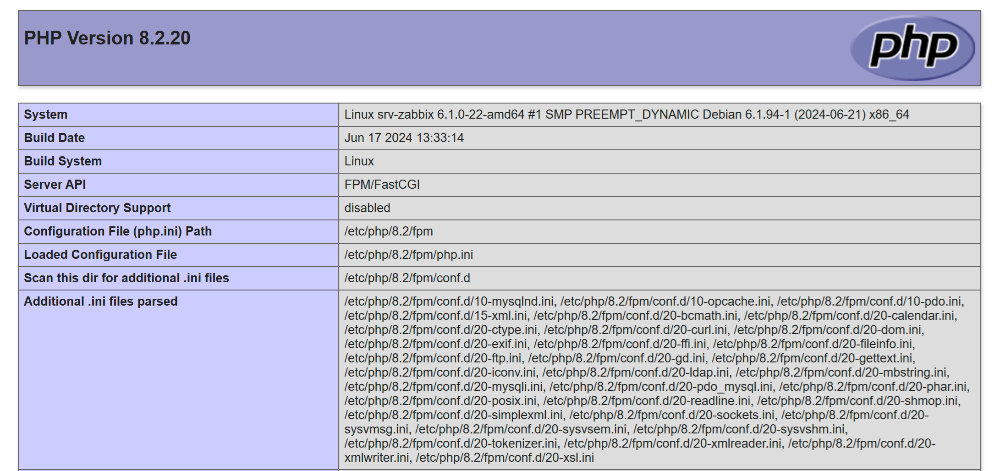

C'est Ok pour la prise en charge de PHP + PHP FPM, passons à la suite.

<a name="balise_04"></a>
## 004 - Installation du serveur MariaDB (MySQL)

Nous devons exécuter la commande comme mentionné ci-dessous :
```
apt -y install mariadb-server
```
```
nano /etc/mysql/mariadb.conf.d/50-server.cnf
```
```
character-set-server  = utf8mb4
collation-server      = utf8mb4_general_ci
```
```
systemctl restart mariadb.service
```
## Sécuriser le serveur MariaDB :
```
mysql_secure_installation
```
```
NOTE: RUNNING ALL PARTS OF THIS SCRIPT IS RECOMMENDED FOR ALL MariaDB
      SERVERS IN PRODUCTION USE!  PLEASE READ EACH STEP CAREFULLY!

In order to log into MariaDB to secure it, we'll need the current
password for the root user. If you've just installed MariaDB, and
haven't set the root password yet, you should just press enter here.

Enter current password for root (enter for none):
OK, successfully used password, moving on...

Setting the root password or using the unix_socket ensures that nobody
can log into the MariaDB root user without the proper authorisation.

You already have your root account protected, so you can safely answer 'n'.

Switch to unix_socket authentication [Y/n] Y
Enabled successfully!
Reloading privilege tables..
 ... Success!


You already have your root account protected, so you can safely answer 'n'.

Change the root password? [Y/n] Y
New password:
Re-enter new password:
Password updated successfully!
Reloading privilege tables..
 ... Success!


By default, a MariaDB installation has an anonymous user, allowing anyone
to log into MariaDB without having to have a user account created for
them.  This is intended only for testing, and to make the installation
go a bit smoother.  You should remove them before moving into a
production environment.

Remove anonymous users? [Y/n] Y
 ... Success!

Normally, root should only be allowed to connect from 'localhost'.  This
ensures that someone cannot guess at the root password from the network.

Disallow root login remotely? [Y/n] Y
 ... Success!

By default, MariaDB comes with a database named 'test' that anyone can
access.  This is also intended only for testing, and should be removed
before moving into a production environment.

Remove test database and access to it? [Y/n] Y
 - Dropping test database...
 ... Success!
 - Removing privileges on test database...
 ... Success!

Reloading the privilege tables will ensure that all changes made so far
will take effect immediately.

Reload privilege tables now? [Y/n] Y
 ... Success!

Cleaning up...

All done!  If you've completed all of the above steps, your MariaDB
installation should now be secure.

Thanks for using MariaDB!
```
```
systemctl restart mariadb.service
```
## Rappel sur les base de MySQL avant de poursuivre.
Si vous ne vous santez pas concerné passer à l'étape suivante, [Cliquer ici.](#balise_05)

Se connecter à MySQL :
```
mysql
```
- [Unix_Socket] authentication is enabled by default :
```
MariaDB [(none)]> show grants for root@localhost;
```
```
+---------------------------------------------------------------------------------------------------------------------------------------------------------------------------+
| Grants for root@localhost                                                                                                                                                 |
+---------------------------------------------------------------------------------------------------------------------------------------------------------------------------+
| GRANT ALL PRIVILEGES ON *.* TO `root`@`localhost` IDENTIFIED VIA mysql_native_password USING '*2538008A2BB77A6ACB52279941975854BA874015' OR unix_socket WITH GRANT OPTION |
| GRANT PROXY ON ''@'%' TO 'root'@'localhost' WITH GRANT OPTION                                                                                                             |
+---------------------------------------------------------------------------------------------------------------------------------------------------------------------------+
2 rows in set (0,000 sec)
```
- Show user list :
```
MariaDB [(none)]> select user,host,password from mysql.user; 
```
```
+-------------+-----------+-------------------------------------------+
| User        | Host      | Password                                  |
+-------------+-----------+-------------------------------------------+
| mariadb.sys | localhost |                                           |
| root        | localhost | *2538008A2BB77A6ACB52279941975854BA874015 |
| mysql       | localhost | invalid                                   |
+-------------+-----------+-------------------------------------------+
3 rows in set (0,001 sec)
```
- Show database list :
```
MariaDB [(none)]> show databases;
```
```
+--------------------+
| Database           |
+--------------------+
| information_schema |
| mysql              |
| performance_schema |
| sys                |
+--------------------+
4 rows in set (0,000 sec)
```
## Create test database :
```
MariaDB [(none)]> create database test_database; 
Query OK, 1 row affected (0.000 sec)
```
- Create test table on test database :
```
MariaDB [(none)]> create table test_database.test_table (id int, name varchar(50), address varchar(50), primary key (id)); 
Query OK, 0 rows affected (0.108 sec)
```
- Insert data to test table :
```
MariaDB [(none)]> insert into test_database.test_table(id, name, address) values("001", "Debian", "Hiroshima"); 
Query OK, 1 row affected (0.036 sec)
```
- Show test table :
```
MariaDB [(none)]> select * from test_database.test_table;
```
```
+----+--------+-----------+
| id | name   | address   |
+----+--------+-----------+
|  1 | Debian | Hiroshima |
+----+--------+-----------+
1 row in set (0.000 sec)
```
- Delete test database :
```
MariaDB [(none)]> drop database test_database; 
Query OK, 1 row affected (0.111 sec)
```
```
MariaDB [(none)]> exit;
```
```
Bye
```
Si vous souhaitez supprimer toutes les données de MariaDB et l'initialiser, exécutez comme suit.
```
systemctl stop mariadb
```
```
rm -rf /var/lib/mysql/*
```
```
mysql_install_db --datadir=/var/lib/mysql --user=mysql
```
```
systemctl start mariadb
```
<a name="balise_05"></a>
## 005 - Installer Server, Frontend, Agent 2 ZABBIX dans sa dernière version stable 7.2.

- Avant de commencer il faut installer et configurer (NTPsec).

[Installer et configurer (NTPsec)](https://github.com/0xCyberLiTech/NTPsec/blob/main/Installer-et-configurer-NTPsec.md)

- Ajoutez les derniers dépôts stable pour Zabbix 7.2.

Pour surveiller Zabbix lui-même, il faudra également installer l'agent Zabbix 2 sur ce serveur et configurer celui-ci.

Suivre la version des derniers dépôts (en prod 7.2) : https://repo.zabbix.com/zabbix/7.2/ à ce jou 28-06-2025.

a). Install Zabbix repository :
```
wget https://repo.zabbix.com/zabbix/7.2/release/debian/pool/main/z/zabbix-release/zabbix-release_latest_7.2+debian12_all.deb
```
```
dpkg -i zabbix-release_latest_7.2+debian12_all.deb
```
```
apt update
```
b). Install Zabbix server, frontend, agent2 :
```
apt install zabbix-server-mysql zabbix-frontend-php zabbix-apache-conf zabbix-sql-scripts zabbix-agent2
```
c). Install Zabbix agent 2 plugins :
Vous souhaiterez peut-être installer les plugins de l'agent Zabbix 2.
```
apt install zabbix-agent2-plugin-mongodb zabbix-agent2-plugin-mssql zabbix-agent2-plugin-postgresql
```
d). Créer la base de données initiale :
Assurez-vous que votre serveur de base de données est opérationnel.

Exécutez la commande suivante sur votre hébergeur de base de données.
```
# mysql -uroot -p
password
mysql> create database zabbix character set utf8mb4 collate utf8mb4_bin;
mysql> create user zabbix@localhost identified by 'password';
mysql> grant all privileges on zabbix.* to zabbix@localhost;
mysql> set global log_bin_trust_function_creators = 1;
mysql> quit;
```
Sur le serveur Zabbix, importez le schéma et les données initiales. Vous serez invité à saisir votre nouveau mot de passe.
```
zcat /usr/share/zabbix/sql-scripts/mysql/server.sql.gz | mysql --default-character-set=utf8mb4 -uzabbix -p zabbix
```
Désactivez l'option log_bin_trust_function_creators après l'importation du schéma de base de données.
```
# mysql -uroot -p
password
mysql> set global log_bin_trust_function_creators = 0;
mysql> quit;
```
e). Configurer la base de données pour le serveur Zabbix :

Modifier le fichier /etc/zabbix/zabbix_server.conf
```
DBPassword=password
```
Modifiez les valeurs PHP pour les exigences Zabbix.
```
nano /etc/php/8.2/fpm/pool.d/www.conf
```
```
; add to the end
php_value[max_execution_time] = 300
php_value[memory_limit] = 128M
php_value[post_max_size] = 16M
php_value[upload_max_filesize] = 2M
php_value[max_input_time] = 300
php_value[max_input_vars] = 10000
php_value[always_populate_raw_post_data] = -1
php_value[date.timezone] = Europe/Paris
```
Enregistrer les modifications et quitter nano
```
Ctrl+o & Ctrl+x
```
f). Démarrer les processus du serveur et de l'agent Zabbix

Démarrez les processus du serveur et de l'agent Zabbix et faites-les démarrer au démarrage du système.
```
systemctl restart zabbix-server zabbix-agent2 apache2
```
```
systemctl enable zabbix-server zabbix-agent2 apache2
```
g). Ouvrir la page Web de l'interface utilisateur de Zabbix

L'URL par défaut de l'interface utilisateur Zabbix lors de l'utilisation du serveur Web Apache est http://host/zabbix

Se rendre vers http://mon-ip-local/zabbix :

Nous allons finaliser cette installation depuis l'interface Web : navigateur :

Phase 01 :


Phase 02 :

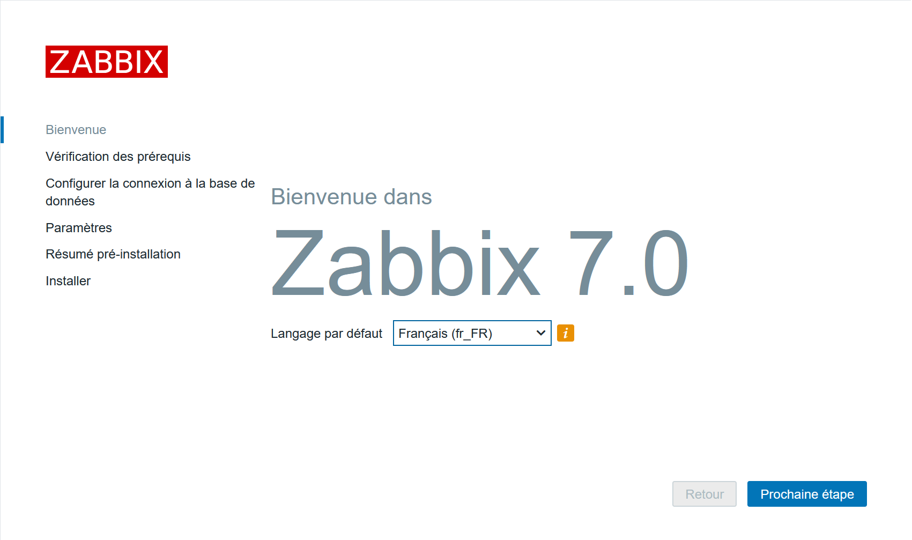

Phase 03 :

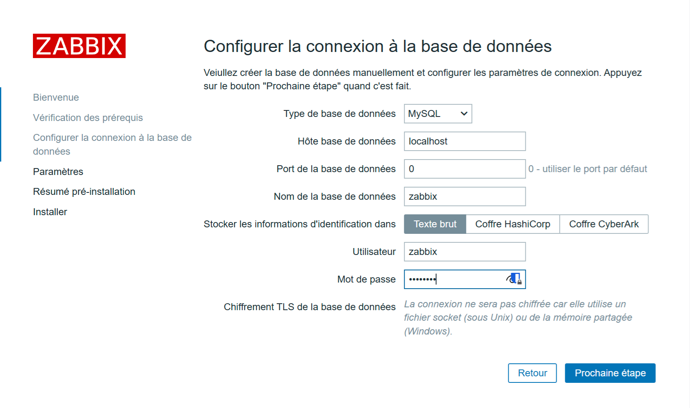

Phase 04 :

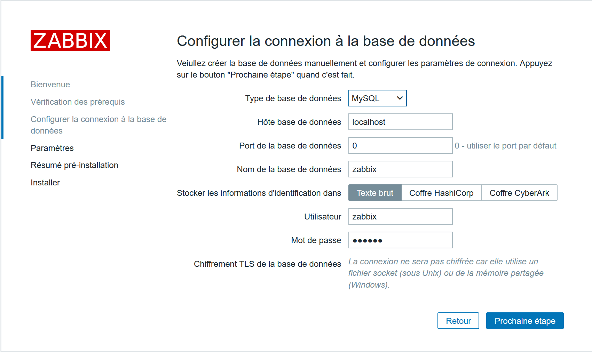

Phase 05 :

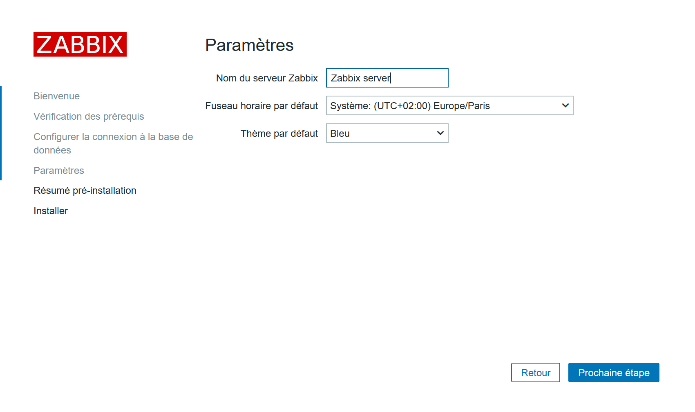

Phase 06 :

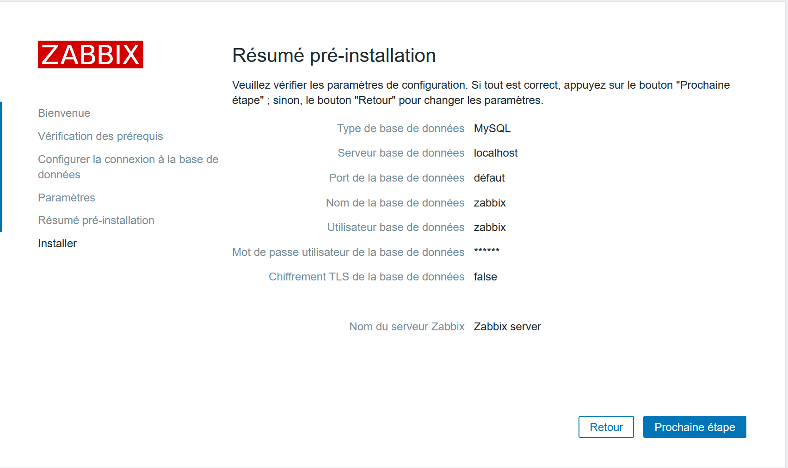

Phase 07 :

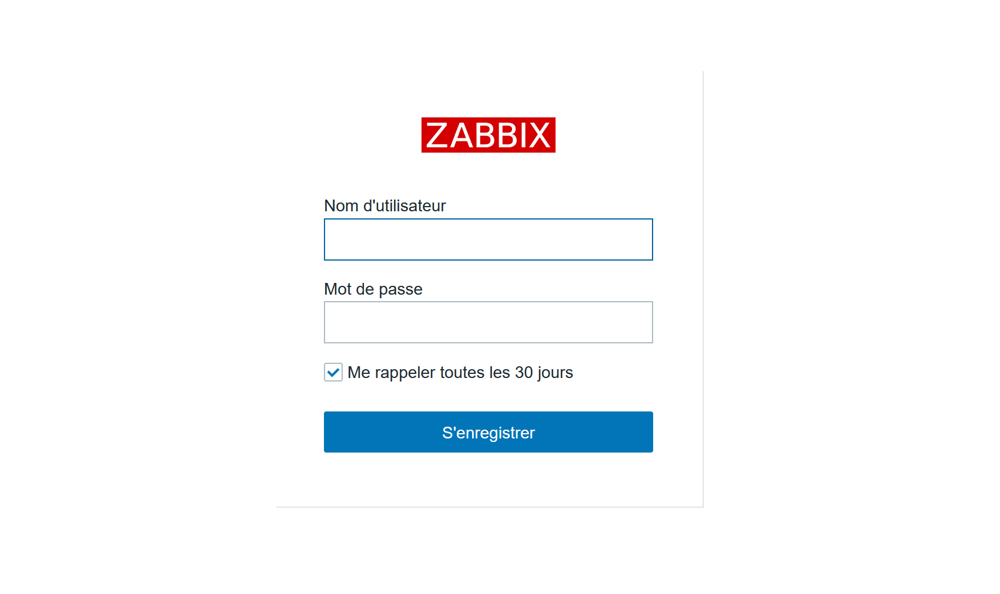

Phase 08 :

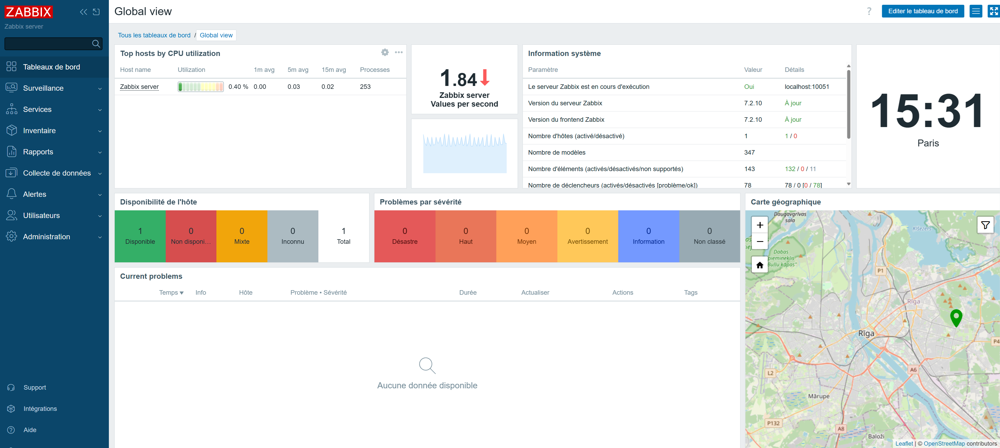

<a name="balise_06"></a>
## 006 - Installez et configurez l'agent Zabbix 2 pour votre plateforme.

a). Install Zabbix repository:

```
wget https://repo.zabbix.com/zabbix/7.2/release/debian/pool/main/z/zabbix-release/zabbix-release_latest_7.2+debian12_all.deb
```

```
dpkg -i zabbix-release_latest_7.2+debian12_all.deb
```

```
apt update
```
b). Install Zabbix agent 2 :

Install zabbix-agent2 package.
```
apt install zabbix-agent2
```
c). Install Zabbix agent 2 plugins

Vous pouvez installer les plugins de l'agent 2 de Zabbix.
```
apt install zabbix-agent2-plugin-mongodb zabbix-agent2-plugin-mssql zabbix-agent2-plugin-postgresql
```
d). Start Zabbix agent 2 process

Démarrez le processus de l'agent Zabbix 2 et faites-le démarrer au démarrage du système.
```
systemctl restart zabbix-agent2
```

```
systemctl enable zabbix-agent2
```
<a name="balise_07"></a>
## 07 - Infos complémentaires :

- A - Message d'erreur ping & ping6
- B - Consultation des logs de l'agent zabbix.
- C - Activation de l'exécution des scripts dans Zabbix.
- D - Utilisation d'un firewall (UFW) sur votre serveur Zabbix.

Allons y commençons par :

- A - Message d'erreur ping & ping6
  
```
At least one of '/usr/sbin/fping', '/usr/sbin/fping6' must exist. Both are missing in the system.
```
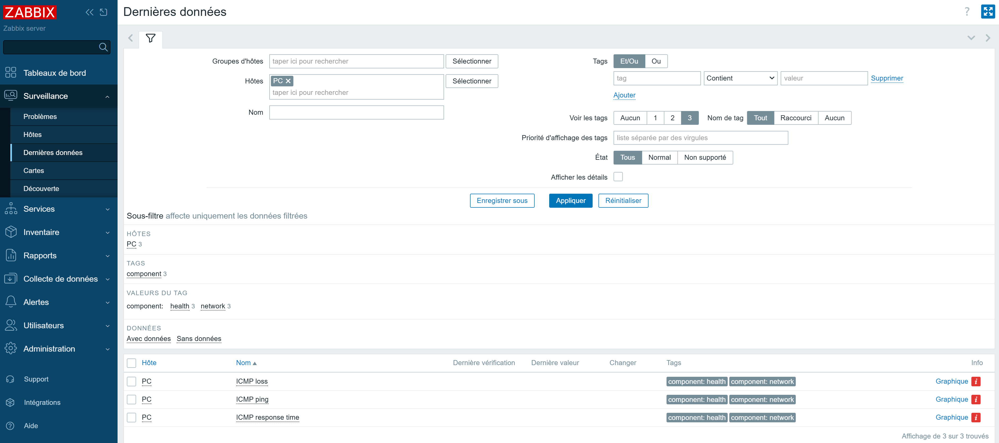

Ce message d’erreur indique que Zabbix ne trouve pas les exécutables fping ou fping6 à l’endroit attendu (/usr/sbin). 

Ces outils sont nécessaires pour les vérifications ICMP (ping) dans Zabbix.

Voici comment résoudre ça 👇

Étapes de résolution
- Vérifie si fping est installé :

```
which fping
```
Chemin qui à été trouvé ou est installé fping :
```
/usr/bin/fping
```
- S’il n’est pas installé, installe-le :

- Sur Debian/Ubuntu :
```
sudo apt install fping
```
- Il est souvent installé dans /usr/bin/fping, alors que Zabbix le cherche dans /usr/sbin.
  
- Deux solutions possibles :

✅ 1 - Créer un lien symbolique :

```
sudo ln -s /usr/bin/fping /usr/sbin/fping
```
```
sudo ln -s /usr/bin/fping6 /usr/sbin/fping6
```
✅ 2 - Ou modifier la config Zabbix : 

Dans /etc/zabbix/zabbix_server.conf, ajoute ou décommente :
```
nano /etc/zabbix/zabbix_server.conf
```
```
FpingLocation=/usr/bin/fping
```
```
Fping6Location=/usr/bin/fping6
```

- B -  Consultation des logs de l'agent zabbix.

```
tail -100f /var/log/zabbix/zabbix_agent2.log
```

- C - Activation de l'exécution des scripts dans Zabbix.

## Très important la variable 'EnableGlobalScripts'  dans le fichier /etc/zabbix/zabbix_server.conf est désactivée par défaut sur ZABBIX 7.2.

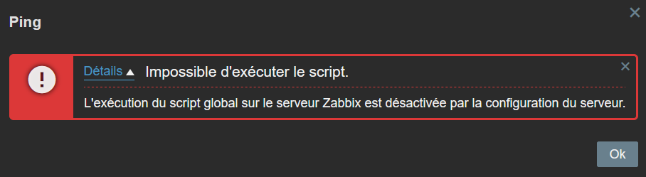

```
nano /etc/zabbix/zabbix_server.conf
```
Avant modification :
```
### Option: EnableGlobalScripts
#    Enable global scripts on Zabbix server.
#       0 - disable
#       1 - enable
#
# Mandatory: no
# Default:
# EnableGlobalScripts=1
EnableGlobalScripts=0
```
Après modification :
```
### Option: EnableGlobalScripts
#    Enable global scripts on Zabbix server.
#       0 - disable
#       1 - enable
#
# Mandatory: no
# Default:
# EnableGlobalScripts=1
EnableGlobalScripts=1
```
Sur le fichier de configuration de l'agent2 apporter les modofications suivantes :
```
nano /etc/zabbix/zabbix_agent2.conf
```
Rajouter la variable 'AllowKey=' & 'Plugins.SystemRun.LogRemoteCommands' :
```
AllowKey=system.run[*]
#Plugins.SystemRun.LogRemoteCommands=1
```
Pour la prise en compte des modifications redémarrer les services zabbix-server, zabbix-agent2 & apache2 :
```
systemctl restart zabbix-server zabbix-agent2 apache2
```
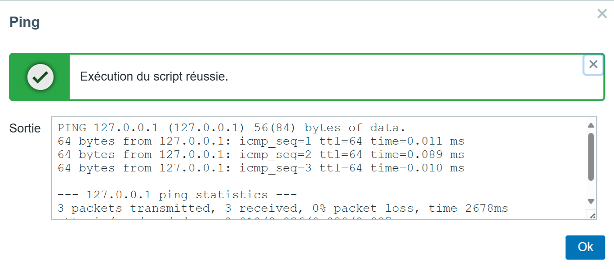

- D - Utilisation d'un firewall (UFW) sur votre serveur Zabbix.

[Vous pouvez obtenir plus de détail sur UFW ici.](https://github.com/0xCyberLiTech/Cybersecurite/blob/main/UFW-installation-et-configuration.md)

Ouvrir le port SSH approprié en entrée, afin d'avoir la main sur votre serveur Zabbix à distance.

Dans cet exemple, je n'autorise que la machine distante 192.168.50.118 à pouvoir accéder en SSH sur le serveur Zabbix au travers du port 2277 en TCP en entrée.
```
ufw limit in on enp86s0 from 192.168.50.118 to 192.168.50.250 port 2277 proto tcp comment '2277 SSH'
```
La variable 'limit' correspond à n'autoriser que 6 tentatives de connexion en 30 secondes sur notre règle. 

Cela permet de renfocer un peu plus la sécurité.

Ouvrir le port 80 sur le serveur Zabbix ainsi que le port 443 en entrée.
```
ufw allow in on enp86s0 from 192.168.50.118 to 192.168.50.250 port 80 proto tcp comment '80 Apache2'
```
```
ufw allow in on enp86s0 from 192.168.50.118 to 192.168.50.250 port 443 proto tcp comment '443 Apache2'
```
- Il faut autoriser le LANSUBNET 192.168.0.0/16 à communiquer vers le serveur Zabbix (192.168.50.250) à travers le port 10050 en TCP, pour le mode passif.
- Il faut autoriser le LANSUBNET 192.168.0.0/16 à communiquer vers le serveur Zabbix (192.168.50.250) à travers le port 10051 en TCP, pour le mode actif.

Ces ports doivent être ouverts en entrée sur le serveur Zabbix, afin de recueillir les communications en provenance des agent Zabbix des hôtes distants, que ce soit en mode passif ou en mode actif.
```
ufw allow in on enp86s0 from 192.168.0.0/16 to 192.168.50.250 port 10050 proto tcp comment '1050 agent Zabbix - For Passive checks'
```
```
ufw allow in on enp86s0 from 192.168.0.0/16 to 192.168.50.250 port 10051 proto tcp comment '1051 agent Zabbix - For Active checks'
```
Lister les règles en service :
```
ufw status numbered
```
```
     To                         Action      From
     --                         ------      ----
[ 1] 192.168.50.250 2277/tcp   on enp86s0 ALLOW IN    192.168.50.118             # 2277 SSH
[ 2] 192.168.50.250 80/tcp     on enp86s0 ALLOW IN    192.168.50.118             # 80 Apache2
[ 3] 192.168.50.250 443/tcp    on enp86s0 ALLOW IN    192.168.50.118             # 443 Apache2
[ 4] 192.168.50.250 10050/tcp  on enp86s0 ALLOW IN    192.168.0.0/16             # 1050 agent Zabbix - For Passive checks
[ 5] 192.168.50.250 10051/tcp  on enp86s0 ALLOW IN    192.168.0.0/16             # 1051 agent Zabbix - For Active checks
```
