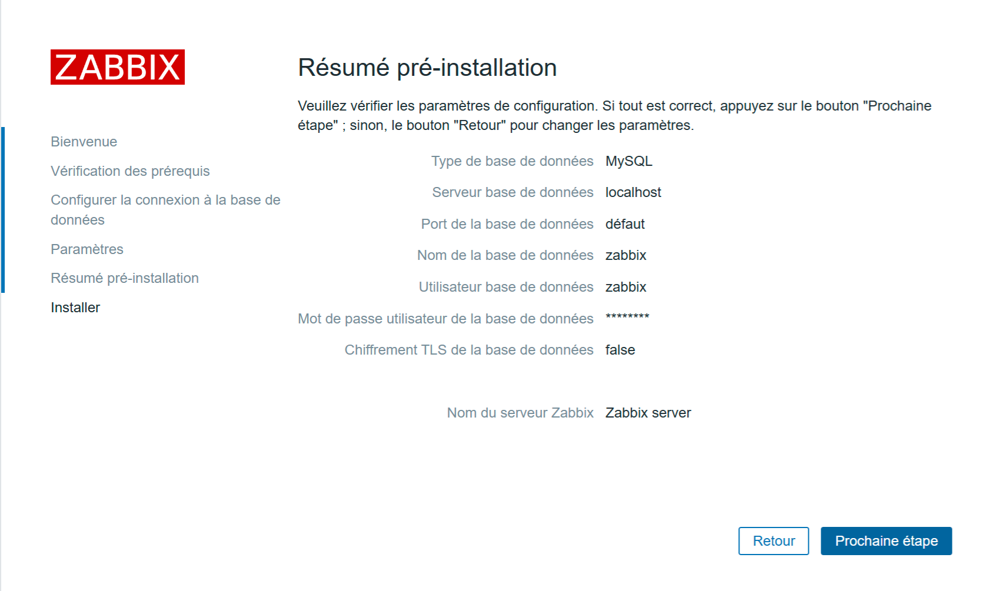

## ZABBIX installation depuis DEBIAN 12 (LAMP + Zabbix version 7.2 + zabbix-agent2.

## Sommaire :

Prérequis :

Mise à jour du système :
```bash
sudo apt update && sudo apt upgrade -y
```
## Commençons par installer notre serveur LAMP.

- 01 - [Installer le serveur Apache2.](#balise_01)
- 02 - [Créé deux VirtualHosts HTTP & HTTPS.](https://github.com/0xCyberLiTech/Apache2/blob/main/Cr%C3%A9%C3%A9-deux-VirtualHosts-HTTP-HTTPS.md)
- 03 - [Installer PHP.](#balise_02) 
- 04 - [Installer MySQL (MariaDB)](#balise_03)
- 05 - [Installer ZABBIX dans sa dernière version stable 7.2 pour la prod.](#balise_04)
- 06 - [Configurer et démarrer l'agent ZABBIX 2 sur le serveur ZABBIX afin de surveiller celui-ci.](#balise_05)

<a name="balise_01"></a>
## Installer le serveur Apache2 :

```bash
sudo apt -y install apache2
```
```bash
sudo systemctl start apache2.service
```
```bash
sudo systemctl enable apache2.service
```
```bash
sudo systemctl status apache2.service
```
<a name="balise_02"></a>
## Installer PHP :

Pour DEBIAN 12 (Bookworm), la version de PHP est 8.2.
Pour DEBIAN 11 (Bullseye), la version de PHP est 7.4.
```bash
sudo apt install php
```
## Installation de PHP-FPM
```bash
sudo apt -y install php-fpm
```
Ajoutez les paramètres dans le ou les Virtualhosts que vous souhaitez associer à PHP-FPM.
```bash
sudo nano /etc/apache2/sites-enabled/000-default.conf
```
```
<VirtualHost *:80>
        <FilesMatch \.php$>
                SetHandler "proxy:unix:/var/run/php/php8.2-fpm.sock|fcgi://localhost/"
        </FilesMatch>
```
```bash
sudo a2enmod proxy_fcgi setenvif
```
```
Considering dependency proxy for proxy_fcgi:
Enabling module proxy.
Enabling module proxy_fcgi.
Module setenvif already enabled
To activate the new configuration, you need to run:
  sudo systemctl restart apache2
```
```bash
sudo systemctl restart apache2.service
```
```bash
sudo a2enconf php8.2-fpm
```
```
Enabling conf php8.2-fpm.
To activate the new configuration, you need to run:
  sudo systemctl reload apache2
```
```bash
sudo systemctl restart php8.2-fpm apache2
```
Créez le fichier [info.php] dans la racine du dossier Web, ( /var/www/html/ ).
```bash
echo '<?php phpinfo(); ?>' | sudo tee /var/www/html/info.php
```
Accéder à l'Url http://mon-ip-local/info.php afin de tester.

On peut constater que le module FPM est pris en charge.

Serveur API <--> FPM/FastCGI


C'est Ok pour la prise en charge de FPM, passons à la suite.

<a name="balise_03"></a>
## Installation du serveur MariaDB (MySQL)

Nous devons exécuter la commande comme mentionné ci-dessous :
```bash
sudo apt -y install mariadb-server
```
```bash
sudo nano /etc/mysql/mariadb.conf.d/50-server.cnf
```
```
character-set-server  = utf8mb4
collation-server      = utf8mb4_general_ci
```
```bash
sudo systemctl restart mariadb.service
```
Sécuriser le serveur MariaDB :
```bash
sudo mysql_secure_installation
```
*(suivre les instructions affichées à l'écran)*

```bash
sudo systemctl restart mariadb.service
```
Se connecter à MySQL :
```bash
sudo mysql
```
- [Unix_Socket] authentication is enabled by default :
```
MariaDB [(none)]> show grants for root@localhost;
```
```
+---------------------------------------------------------------------------------------------------------------------------------------------------------------------------+
| Grants for root@localhost                                                                                                                                                 |
+---------------------------------------------------------------------------------------------------------------------------------------------------------------------------+
| GRANT ALL PRIVILEGES ON *.* TO `root`@`localhost` IDENTIFIED VIA mysql_native_password USING '*2538008A2BB77A6ACB52279941975854BA874015' OR unix_socket WITH GRANT OPTION |
| GRANT PROXY ON ''@'%' TO 'root'@'localhost' WITH GRANT OPTION                                                                                                             |
+---------------------------------------------------------------------------------------------------------------------------------------------------------------------------+
2 rows in set (0,000 sec)
```
- Show user list :
```
MariaDB [(none)]> select user,host,password from mysql.user; 
```
```
+-------------+-----------+-------------------------------------------+
| User        | Host      | Password                                  |
+-------------+-----------+-------------------------------------------+
| mariadb.sys | localhost |                                           |
| root        | localhost | *2538008A2BB77A6ACB52279941975854BA874015 |
| mysql       | localhost | invalid                                   |
+-------------+-----------+-------------------------------------------+
3 rows in set (0,001 sec)
```
- Show database list :
```
MariaDB [(none)]> show databases;
```
```
+--------------------+
| Database           |
+--------------------+
| information_schema |
| mysql              |
| performance_schema |
| sys                |
+--------------------+
4 rows in set (0,000 sec)
```
## Create test database :
```
MariaDB [(none)]> create database test_database; 
Query OK, 1 row affected (0.000 sec)
```
- Create test table on test database :
```
MariaDB [(none)]> create table test_database.test_table (id int, name varchar(50), address varchar(50), primary key (id)); 
Query OK, 0 rows affected (0.108 sec)
```
- Insert data to test table :
```
MariaDB [(none)]> insert into test_database.test_table(id, name, address) values("001", "Debian", "Hiroshima"); 
Query OK, 1 row affected (0.036 sec)
```
- Show test table :
```
MariaDB [(none)]> select * from test_database.test_table;
```
```
+----+--------+-----------+
| id | name   | address   |
+----+--------+-----------+
|  1 | Debian | Hiroshima |
+----+--------+-----------+
1 row in set (0.000 sec)
```
- Delete test database :
```
MariaDB [(none)]> drop database test_database; 
Query OK, 1 row affected (0.111 sec)
```
```
MariaDB [(none)]> exit;
```
```
Bye
```
Si vous souhaitez supprimer toutes les données de MariaDB et l'initialiser, exécutez comme suit.
```bash
sudo systemctl stop mariadb
```
```bash
sudo rm -rf /var/lib/mysql/*
```
```bash
sudo mysql_install_db --datadir=/var/lib/mysql --user=mysql
```
```bash
sudo systemctl start mariadb
```
<a name="balise_04"></a>
## Installer Zabbix dans sa dernière version stable 7.2 à ce jour (28-06-2025).

- Avant de commencer il faut installer et configurer (NTPsec).

[Installer et configurer (NTPsec)](https://github.com/0xCyberLiTech/NTPsec/blob/main/Installer-et-configurer-NTPsec.md)

- Ajoutez les derniers dépôts stable pour Zabbix 7.2.

Pour surveiller Zabbix lui-même, il faudra également installer l'agent Zabbix 2 sur ce serveur et configurer celui-ci.

Suivre la version des derniers dépôts (en prod 7.2) : https://repo.zabbix.com/zabbix/7.2/ à ce jou 28-06-2025.

Zabbix Official Repository
```bash
wget https://repo.zabbix.com/zabbix/7.2/release/debian/pool/main/z/zabbix-release/zabbix-release_latest_7.2+debian12_all.deb
```
```bash
sudo dpkg -i zabbix-release_latest_7.2+debian12_all.deb
```
```bash
sudo apt update
```
De nouveaux dépôts seront installés.
```bash
sudo nano /etc/apt/sources.list.d/zabbix.list
```
```
# Zabbix main repository
deb https://repo.zabbix.com/zabbix/7.2/stable/debian bookworm main
deb-src https://repo.zabbix.com/zabbix/7.2/stable/debian bookworm main
```
```bash
sudo apt update
```
```bash
sudo apt -y install zabbix-server-mysql zabbix-frontend-php zabbix-apache-conf zabbix-sql-scripts zabbix-agent2 php-mysql php-gd php-bcmath php-net-socket
```
Créez une base de données nommée zabbix.
```bash
sudo mysql
```
```
create database zabbix character set utf8mb4 collate utf8mb4_bin;
```
Remplacez-le [mot de passe] par le mot de passe de votre choix :
```
grant all privileges on zabbix.* to zabbix@'localhost' identified by 'zabbix';
```
```
set global log_bin_trust_function_creators = 1;
```
```
exit;
```
```bash
zcat /usr/share/zabbix-sql-scripts/mysql/server.sql.gz | mysql -uzabbix -p zabbix
```
Le mot de passe que vous avez défini ci-dessus pour l'utilisateur [zabbix]
Configurez et démarrez Zabbix Server.
```bash
sudo nano /etc/zabbix/zabbix_server.conf
```
```
DBName=zabbix
```
```
DBUser=zabbix
```
```
DBPassword=zabbix
```
Enregistrez les modifications et quittez nano
```
Ctrl+o & Ctrl+x
```
Redémarrez le service Zabbix Server.
```bash
sudo systemctl restart zabbix-server.service
```
```bash
sudo systemctl enable zabbix-server.service
```
<a name="balise_05"></a>
## Configurez et démarrez l'agent Zabbix pour surveiller le serveur Zabbix lui-même.
```bash
sudo nano /etc/zabbix/zabbix_agent2.conf
```
```
Server=127.0.0.1
```
```
ServerActive=127.0.0.1
```
```
Hostname=Zabbix server
```
Enregistrez les modifications et quittez nano
```
Ctrl+o & Ctrl+x
```
```bash
sudo systemctl restart zabbix-agent2.service
```
Modifiez les valeurs PHP pour les exigences Zabbix.
```bash
sudo nano /etc/php/8.2/fpm/pool.d/www.conf
```
```
# add to the end
php_value[max_execution_time] = 300
php_value[memory_limit] = 128M
php_value[post_max_size] = 16M
php_value[upload_max_filesize] = 2M
php_value[max_input_time] = 300
php_value[max_input_vars] = 10000
php_value[always_populate_raw_post_data] = -1
php_value[date.timezone] = Europe/Paris
```
Enregistrez les modifications et quittez nano
```
Ctrl+o & Ctrl+x
```
Vérification de la configuration /etc/apache2/conf-enabled/zabbix.conf
```bash
sudo nano /etc/apache2/conf-enabled/zabbix.conf
```
```
# Define /zabbix alias, this is the default
<IfModule mod_alias.c>
    Alias /zabbix /usr/share/zabbix
</IfModule>

<Directory "/usr/share/zabbix">
    Options FollowSymLinks
    AllowOverride None
    Order allow,deny
    Allow from all

    <IfModule mod_php.c>
        php_value max_execution_time 300
        php_value memory_limit 128M
        php_value post_max_size 16M
        php_value upload_max_filesize 2M
        php_value max_input_time 300
        php_value max_input_vars 10000
        php_value always_populate_raw_post_data -1
        php_value date.timezone Europe/Paris
    </IfModule>

    <IfModule mod_php7.c>
        php_value max_execution_time 300
        php_value memory_limit 128M
        php_value post_max_size 16M
        php_value upload_max_filesize 2M
        php_value max_input_time 300
        php_value max_input_vars 10000
        php_value always_populate_raw_post_data -1
        php_value[date.timezone] = Europe/Paris
    </IfModule>
</Directory>

<Directory "/usr/share/zabbix/conf">
    Order deny,allow
    Deny from all
    <files *.php>
        Order deny,allow
        Deny from all
    </files>
</Directory>

<Directory "/usr/share/zabbix/app">
    Order deny,allow
    Deny from all
    <files *.php>
        Order deny,allow
        Deny from all
    </files>
</Directory>

<Directory "/usr/share/zabbix/include">
    Order deny,allow
    Deny from all
    <files *.php>
        Order deny,allow
        Deny from all
    </files>
</Directory>

<Directory "/usr/share/zabbix/local">
    Order deny,allow
    Deny from all
    <files *.php>
        Order deny,allow
        Deny from all
    </files>
</Directory>

<Directory "/usr/share/zabbix/vendor">
    Order deny,allow
    Deny from all
    <files *.php>
        Order deny,allow
        Deny from all
    </files>
</Directory>
```
```bash
sudo systemctl restart apache2 php8.2-fpm
```
Redémarrer les services zabbix-server zabbix-agent2 et apache2
```bash
sudo systemctl restart zabbix-server zabbix-agent2 apache2
```
```bash
sudo systemctl enable zabbix-server zabbix-agent2 apache2
```
Info pour la consultation des logs de l'agent zabbix :
```bash
sudo tail -100f /var/log/zabbix/zabbix_agent2.log
```
Se rendre vers http://mon-ip-local/zabbix :

Nous allons finaliser cette installation depuis notre navigateur :

Phase 01 :


Phase 02 :


Phase 03 :


Phase 04 :


Phase 05 :



Phase 06 :


Phase 07 :


Phase 08 :


## Très important la variable 'EnableGlobalScripts'  dans le fichier /etc/zabbix/zabbix_server.conf est désactivée par défaut sur ZABBIX 7.2.


```bash
sudo nano /etc/zabbix/zabbix_server.conf
```
Avant modification :
```
### Option: EnableGlobalScripts
#    Enable global scripts on Zabbix server.
#       0 - disable
#       1 - enable
#
# Mandatory: no
# Default:
# EnableGlobalScripts=1
EnableGlobalScripts=0
```
Après modification :
```
### Option: EnableGlobalScripts
#    Enable global scripts on Zabbix server.
#       0 - disable
#       1 - enable
#
# Mandatory: no
# Default:
# EnableGlobalScripts=1
EnableGlobalScripts=1
```
Sur le fichier de configuration de l'agent2 apporter les modifications suivantes :
```bash
sudo nano /etc/zabbix/zabbix_agent2.conf
```
Rajouter la variable 'AllowKey=' & 'Plugins.SystemRun.LogRemoteCommands' :
```
AllowKey=system.run[*]
#Plugins.SystemRun.LogRemoteCommands=1
```
Pour la prise en compte des modifications redémarrer les services zabbix-server, zabbix-agent2 & apache2 :
```bash
sudo systemctl restart zabbix-server zabbix-agent2 apache2
```


## Concernant l'utilisation d'un firewall (UFW) sur votre serveur Zabbix :

[Vous pouvez obtenir plus de détail sur UFW ici.](https://github.com/0xCyberLiTech/Cybersecurite/blob/main/UFW-installation-et-configuration.md)

Ouvrir le port SSH approprié en entrée, afin d'avoir la main sur votre serveur Zabbix à distance.

Dans cet exemple, je n'autorise que la machine distante 192.168.50.118 à pouvoir accéder en SSH sur le serveur Zabbix au travers du port 2277 en TCP en entrée.
```bash
sudo ufw limit in on enp86s0 from 192.168.50.118 to 192.168.50.250 port 2277 proto tcp comment '2277 SSH'
```
La variable 'limit' correspond à n'autoriser que 6 tentatives de connexion en 30 secondes sur notre règle. 

Cela permet de renforcer un peu plus la sécurité.

Ouvrir le port 80 sur le serveur Zabbix ainsi que le port 443 en entrée.
```bash
sudo ufw allow in on enp86s0 from 192.168.50.118 to 192.168.50.250 port 80 proto tcp comment '80 Apache2'
```
```bash
sudo ufw allow in on enp86s0 from 192.168.50.118 to 192.168.50.250 port 443 proto tcp comment '443 Apache2'
```
- Il faut autoriser le LANSUBNET 192.168.0.0/16 à communiquer vers le serveur Zabbix (192.168.50.250) à travers le port 10050 en TCP, pour le mode passif.
- Il faut autoriser le LANSUBNET 192.168.0.0/16 à communiquer vers le serveur Zabbix (192.168.50.250) à travers le port 10051 en TCP, pour le mode actif.

Ces ports doivent être ouverts en entrée sur le serveur Zabbix, afin de recueillir les communications en provenance des agent Zabbix des hôtes distants, que ce soit en mode passif ou en mode actif.
```bash
sudo ufw allow in on enp86s0 from 192.168.0.0/16 to 192.168.50.250 port 10050 proto tcp comment '1050 agent Zabbix - For Passive checks'
```
```bash
sudo ufw allow in on enp86s0 from 192.168.0.0/16 to 192.168.50.250 port 10051 proto tcp comment '1051 agent Zabbix - For Active checks'
```
Lister les règles en service :
```bash
sudo ufw status numbered
```
```
     To                         Action      From
     --                         ------      ----
[ 1] 192.168.50.250 2277/tcp on enp86s0 ALLOW IN    192.168.50.118             # 2277 SSH
[ 2] 192.168.50.250 80/tcp on enp86s0 ALLOW IN    192.168.50.118             # 80 Apache2
[ 3] 192.168.50.250 443/tcp on enp86s0 ALLOW IN    192.168.50.118             # 443 Apache2
[ 4] 192.168.50.250 10050/tcp on enp86s0 ALLOW IN    192.168.0.0/16             # 1050 agent Zabbix - For Passive checks
[ 5] 192.168.50.250 10051/tcp on enp86s0 ALLOW IN    192.168.0.0/16             # 1051 agent Zabbix - For Active checks
```
