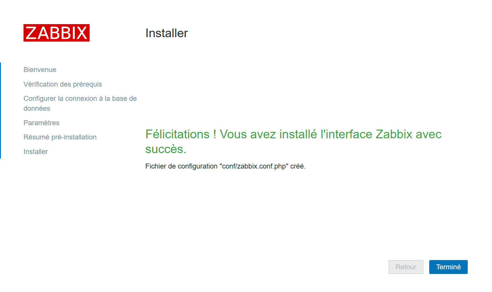

# ZABBIX 7.2 – Installation sur Debian 12 (LAMP & Agent2)

## Sommaire

- Prérequis
- Mise à jour du système
- Installation du serveur LAMP (Apache2, PHP, MariaDB)
- Installation et configuration de Zabbix 7.2
- Configuration de l’agent Zabbix 2
- Configuration du firewall (UFW)
- Finalisation et captures d’écran

---

## Prérequis

- Debian 12 à jour
- Accès sudo/root
- Connexion Internet

---

## Mise à jour du système

```bash
sudo apt update && sudo apt upgrade -y
```

---

## Installer Apache2

```bash
sudo apt -y install apache2
sudo systemctl start apache2.service
sudo systemctl enable apache2.service
sudo systemctl status apache2.service
```

---

## Installer PHP

Pour Debian 12 (Bookworm), la version de PHP est 8.2.

```bash
sudo apt install php
sudo apt -y install php-fpm
```

Activez PHP-FPM sur Apache2 :

```bash
sudo nano /etc/apache2/sites-enabled/000-default.conf
```

Ajoutez/modifiez :

```apacheconf
<VirtualHost *:80>
    <FilesMatch \.php$>
        SetHandler "proxy:unix:/var/run/php/php8.2-fpm.sock|fcgi://localhost/"
    </FilesMatch>
</VirtualHost>
```

Activez les modules nécessaires et redémarrez Apache :

```bash
sudo a2enmod proxy_fcgi setenvif
sudo systemctl restart apache2.service
sudo a2enconf php8.2-fpm
sudo systemctl restart php8.2-fpm apache2
```

Créez un fichier info.php pour tester :

```bash
echo '<?php phpinfo(); ?>' | sudo tee /var/www/html/info.php
```

Rendez-vous sur http://mon-ip-local/info.php pour vérifier.


---

## Installer MariaDB (MySQL)

```bash
sudo apt -y install mariadb-server
sudo systemctl restart mariadb.service
```

Sécurisez MariaDB :

```bash
sudo mysql_secure_installation
```

Suivez les étapes pour :
- Définir un mot de passe root
- Supprimer les utilisateurs anonymes
- Désactiver l’accès root distant
- Supprimer la base de test…

Pour changer l'encodage par défaut :

```bash
sudo nano /etc/mysql/mariadb.conf.d/50-server.cnf
```

Ajoutez :

```ini
character-set-server  = utf8mb4
collation-server      = utf8mb4_general_ci
```

Redémarrez MariaDB :

```bash
sudo systemctl restart mariadb.service
```

---

## Installer les dépôts Zabbix 7.2

Avant de commencer, installe et configure NTPsec :  
[Installer et configurer NTPsec](https://github.com/0xCyberLiTech/NTPsec/blob/main/Installer-et-configurer-NTPsec.md)

Ajoutez le dépôt officiel Zabbix :

```bash
wget https://repo.zabbix.com/zabbix/7.2/release/debian/pool/main/z/zabbix-release/zabbix-release_latest_7.2+debian12_all.deb
sudo dpkg -i zabbix-release_latest_7.2+debian12_all.deb
sudo apt update
```

---

## Installer Zabbix server, frontend, agent2

```bash
sudo apt -y install zabbix-server-mysql zabbix-frontend-php zabbix-apache-conf zabbix-sql-scripts zabbix-agent2 php-mysql php-gd php-bcmath php-net-socket
```

---

## Créer la base de données Zabbix

Connectez-vous à MariaDB :

```bash
sudo mysql
```

Et exécutez :

```sql
create database zabbix character set utf8mb4 collate utf8mb4_bin;
grant all privileges on zabbix.* to zabbix@'localhost' identified by 'zabbix';
set global log_bin_trust_function_creators = 1;
exit;
```

---

## Importer le schéma de la base

```bash
zcat /usr/share/zabbix-sql-scripts/mysql/server.sql.gz | mysql -uzabbix -p zabbix
```

---

## Configurer Zabbix Server

```bash
sudo nano /etc/zabbix/zabbix_server.conf
```

Assurez-vous d’avoir :

```ini
DBName=zabbix
DBUser=zabbix
DBPassword=zabbix
```

---

## Démarrer Zabbix Server

```bash
sudo systemctl restart zabbix-server.service
sudo systemctl enable zabbix-server.service
```

---

## Configurer et démarrer l’agent Zabbix 2

```bash
sudo nano /etc/zabbix/zabbix_agent2.conf
```

Modifiez/ajoutez :

```ini
Server=127.0.0.1
ServerActive=127.0.0.1
Hostname=Zabbix server
```

Enregistrez puis :

```bash
sudo systemctl restart zabbix-agent2.service
```

---

## Adapter la configuration PHP pour Zabbix

```bash
sudo nano /etc/php/8.2/fpm/pool.d/www.conf
```

Ajoutez à la fin :

```ini
php_value[max_execution_time] = 300
php_value[memory_limit] = 128M
php_value[post_max_size] = 16M
php_value[upload_max_filesize] = 2M
php_value[max_input_time] = 300
php_value[max_input_vars] = 10000
php_value[always_populate_raw_post_data] = -1
php_value[date.timezone] = Europe/Paris
```

Redémarrez les services :

```bash
sudo systemctl restart php8.2-fpm apache2
```

---

## Vérifier la configuration Apache pour Zabbix

```bash
sudo nano /etc/apache2/conf-enabled/zabbix.conf
```

Vérifiez ou adaptez les valeurs PHP selon les recommandations Zabbix.

Redémarrez tous les services :

```bash
sudo systemctl restart zabbix-server zabbix-agent2 apache2
sudo systemctl enable zabbix-server zabbix-agent2 apache2
```

---

## Vérifier les logs de l’agent Zabbix

```bash
sudo tail -100f /var/log/zabbix/zabbix_agent2.log
```

---

## Finalisation via le navigateur

Ouvrez http://mon-ip-local/zabbix et suivez l’assistant graphique.  
Voici les différentes phases :

_Phase 01 :_


_Phase 02 :_


_Phase 03 :_


_Phase 04 :_


_Phase 05 :_


_Phase 06 :_


_Phase 07 :_


_Phase 08 :_


---

## Variables importantes à vérifier

Dans `/etc/zabbix/zabbix_server.conf`, activez les scripts globaux si besoin :

```bash
sudo nano /etc/zabbix/zabbix_server.conf
```
Avant :

```ini
EnableGlobalScripts=0
```
Après :

```ini
EnableGlobalScripts=1
```

---

## Personnalisation de l’agent Zabbix

Dans `/etc/zabbix/zabbix_agent2.conf`, ajoutez si besoin :

```ini
AllowKey=system.run[*]
#Plugins.SystemRun.LogRemoteCommands=1
```

Redémarrez :

```bash
sudo systemctl restart zabbix-server zabbix-agent2 apache2
```

---

## Exemple de test :


---

## Sécuriser avec UFW (Firewall)

Ouvrez les ports nécessaires :

```bash
sudo ufw limit in on enp86s0 from 192.168.50.118 to 192.168.50.250 port 2277 proto tcp comment '2277 SSH'
sudo ufw allow in on enp86s0 from 192.168.50.118 to 192.168.50.250 port 80 proto tcp comment '80 Apache2'
sudo ufw allow in on enp86s0 from 192.168.50.118 to 192.168.50.250 port 443 proto tcp comment '443 Apache2'
sudo ufw allow in on enp86s0 from 192.168.0.0/16 to 192.168.50.250 port 10050 proto tcp comment '1050 agent Zabbix - For Passive checks'
sudo ufw allow in on enp86s0 from 192.168.0.0/16 to 192.168.50.250 port 10051 proto tcp comment '1051 agent Zabbix - For Active checks'
```

Listez les règles actives :

```bash
sudo ufw status numbered
```

---

## Documentation complémentaire

- [Création de VirtualHosts Apache2](https://github.com/0xCyberLiTech/Apache2/blob/main/Cr%C3%A9%C3%A9-deux-VirtualHosts-HTTP-HTTPS.md)
- [Configurer NTPsec](https://github.com/0xCyberLiTech/NTPsec/blob/main/Installer-et-configurer-NTPsec.md)
- [Firewall UFW](https://github.com/0xCyberLiTech/Cybersecurite/blob/main/UFW-installation-et-configuration.md)
