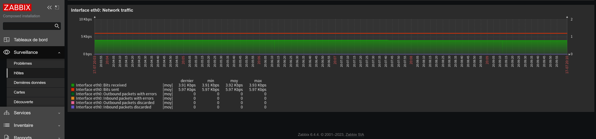
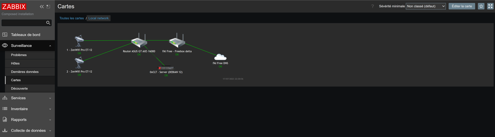

images_build.yml
https://github.com/zabbix/zabbix-docker/actions/workflows/images_build.yml

# - B. Installation de ZABBIX depuis docker compose v2.

Pour l’installation de Zabbix avec Docker, nous allons utiliser un fichier docker-compose.yml pour configurer les différents de Zabbix :

- Le serveur Zabbix.
- La base de données (MariaDB).
- L’interface Web.
- Un agent de supervision pour le serveur Zabbix.

Prérequis :

Cette procédure à été testée depuis une machine sous (Debian 12) avec Docker, Docker compose v2 et Portainer.

Vous trouverez ici un tutoriel sur l’installation de Docker, Docker compose v2 & Portainer.

- Installation manuelle de Docker Engine et Docker-compose-plugin v2, [disponible ici](https://github.com/0xCyberLiTech/Docker/blob/main/README.md#balise-01)

- Installation manuelle de Portainer, [disponible ici](https://github.com/0xCyberLiTech/Docker/blob/main/README.md#installation-manuelle-de-portainer)

Sur votre serveur créé un dossier, qui va recevoir une copie des fichiers du dépôt et les données de Zabbix.

Création du dossier ~/zabbix/.
```
mkdir ~/zabbix/
```
```
cd ~/zabbix/
```
Une fois dans votre dossier créé, entrer la commande ci-dessous pour cloner le dépôt :
```
sudo git clone https://git.rdr-it.io/docker/zabbix.git .
```
docker-compose.yml, qui contient la définitions des différents conteneurs.

Avant de récupérer les images et de les démarrer, je vous conseille de modifier les mots de passe pour la base MariaDB.

Aller dans le dossier env_vars qui contient les différents fichiers de configuration.
```
cd env_vars
```
A minima, éditer les fichiers .MYSQL_PASSWORD et .MYSQL_ROOT_PASSWORD, changer par un mot de passe personnalisé.

Remonter d’un niveau dans les dossiers pour retourner où se trouve le fichier docker-compose.yml.
```
cd ..
```
On va maintenant pouvoir télécharger les images, avant je vous invite à lire le fichier docker-compose.yml dont voici un aperçu :
```
version: '3.8'
services:
  zabbix-server:
    image: zabbix/zabbix-server-mysql:alpine-6.4-latest
    restart: always
    ports:
      - "10051:10051"
    volumes:
      - /etc/localtime:/etc/localtime:ro
      - /etc/timezone:/etc/timezone:ro
      - ./zbx_env/usr/lib/zabbix/alertscripts:/usr/lib/zabbix/alertscripts:ro
      - ./zbx_env/usr/lib/zabbix/externalscripts:/usr/lib/zabbix/externalscripts:ro
      - ./zbx_env/var/lib/zabbix/export:/var/lib/zabbix/export:rw
      - ./zbx_env/var/lib/zabbix/modules:/var/lib/zabbix/modules:ro
      - ./zbx_env/var/lib/zabbix/enc:/var/lib/zabbix/enc:ro
      - ./zbx_env/var/lib/zabbix/ssh_keys:/var/lib/zabbix/ssh_keys:ro
      - ./zbx_env/var/lib/zabbix/mibs:/var/lib/zabbix/mibs:ro
      - snmptraps:/var/lib/zabbix/snmptraps:rw
    deploy:
      resources:
        limits:
          memory: 2G
        reservations:
          memory: 1G
    env_file:
      - ./env_vars/.env_db_mysql
      - ./env_vars/.env_srv
    secrets:
      - MYSQL_USER
      - MYSQL_PASSWORD
      - MYSQL_ROOT_PASSWORD
    depends_on:
      - mysql-server
    networks:
      zbx_net_backend:
        aliases:
          - zabbix-server
          - zabbix-server-mysql
          - zabbix-server-alpine-mysql
          - zabbix-server-mysql-alpine
      zbx_net_frontend:
    stop_grace_period: 30s
    sysctls:
      - net.ipv4.ip_local_port_range=1024 65000
      - net.ipv4.conf.all.accept_redirects=0
      - net.ipv4.conf.all.secure_redirects=0
      - net.ipv4.conf.all.send_redirects=0
    labels:
      com.zabbix.description: "Zabbix server with MySQL database support"
      com.zabbix.company: "Zabbix LLC"
      com.zabbix.component: "zabbix-server"
      com.zabbix.dbtype: "mysql"
      com.zabbix.os: "alpine"

  zabbix-web-nginx-mysql:
    image: zabbix/zabbix-web-nginx-mysql:alpine-6.4-latest
    restart: always
    ports:
      - "8080:8080"
      - "8443:8443"
    volumes:
      - /etc/localtime:/etc/localtime:ro
      - /etc/timezone:/etc/timezone:ro
      - ./zbx_env/etc/ssl/nginx:/etc/ssl/nginx:ro
      - ./zbx_env/usr/share/zabbix/modules/:/usr/share/zabbix/modules/:ro
    deploy:
      resources:
        limits:
          memory: 1G
        reservations:
          memory: 512M
    env_file:
      - ./env_vars/.env_db_mysql
      - ./env_vars/.env_web
    secrets:
      - MYSQL_USER
      - MYSQL_PASSWORD
    depends_on:
      - mysql-server
      - zabbix-server
    healthcheck:
      test: ["CMD", "curl", "-f", "http://localhost:8080/"]
      interval: 10s
      timeout: 5s
      retries: 3
      start_period: 30s
    networks:
      zbx_net_backend:
        aliases:
        - zabbix-web-nginx-mysql
        - zabbix-web-nginx-alpine-mysql
        - zabbix-web-nginx-mysql-alpine
      zbx_net_frontend:
    stop_grace_period: 10s
    sysctls:
    - net.core.somaxconn=65535
    labels:
      com.zabbix.description: "Zabbix frontend on Nginx web-server with MySQL database support"
      com.zabbix.company: "Zabbix LLC"
      com.zabbix.component: "zabbix-frontend"
      com.zabbix.webserver: "nginx"
      com.zabbix.dbtype: "mysql"
      com.zabbix.os: "alpine"

  mysql-server:
    # https://hub.docker.com/_/mariadb
    image: mariadb:10.11.4
    restart: always
    command:
      - mysqld
      - --character-set-server=utf8mb4
      - --collation-server=utf8mb4_bin
      - --skip-character-set-client-handshake
      - --default-authentication-plugin=mysql_native_password
    volumes:
      - ./zbx_env/var/lib/mysql:/var/lib/mysql:rw
    env_file:
      - ./env_vars/.env_db_mysql
    secrets:
      - MYSQL_USER
      - MYSQL_PASSWORD
      - MYSQL_ROOT_PASSWORD
    stop_grace_period: 1m
    networks:
      zbx_net_backend:
        aliases:
        - mysql-server
        - zabbix-database
        - mysql-databasse

  zabbix-agent:
    image: zabbix/zabbix-agent:alpine-6.4-latest
    restart: always
    ports:
      - "10050:10050"
    volumes:
      - /etc/localtime:/etc/localtime:ro
      - /etc/timezone:/etc/timezone:ro
      - ./zbx_env/etc/zabbix/zabbix_agentd.d:/etc/zabbix/zabbix_agentd.d:ro
      - ./zbx_env/var/lib/zabbix/modules:/var/lib/zabbix/modules:ro
      - ./zbx_env/var/lib/zabbix/enc:/var/lib/zabbix/enc:ro
      - ./zbx_env/var/lib/zabbix/ssh_keys:/var/lib/zabbix/ssh_keys:ro
    env_file:
      - ./env_vars/.env_agent
    networks:
      zbx_net_backend:
        aliases:
        - zabbix-agent
        - zabbix-agent-passive
        - zabbix-agent-alpine

networks:
  zbx_net_frontend:
    driver: bridge
    driver_opts:
      com.docker.network.enable_ipv6: "false"
    ipam:
      driver: default
      config:
      - subnet: 172.16.238.0/24
  zbx_net_backend:
    driver: bridge
    driver_opts:
      com.docker.network.enable_ipv6: "false"
    internal: true
    ipam:
      driver: default
      config:
      - subnet: 172.16.239.0/24

volumes:
  snmptraps:

secrets:
  MYSQL_USER:
    file: ./env_vars/.MYSQL_USER
  MYSQL_PASSWORD:
    file: ./env_vars/.MYSQL_PASSWORD
  MYSQL_ROOT_PASSWORD:
    file: ./env_vars/.MYSQL_ROOT_PASSWORD
```
Télécharger les différentes images :
```
sudo docker compose pull
```
Lancer les conteneurs pour démarrer Zabbix.

Pour le premier démarrage, je vous conseille de ne pas détacher l’exécution des conteneurs afin d’avoir le retour dans le terminal, pour cela on démarré les conteneurs sans l’option -d.

Entrer la commande suivante :
```
sudo docker compose up
```
Le meilleur moyen de savoir si tout fonctionne maintenant et d’essayer d’aller sur Zabbix depuis un navigateur.

Identifiant de connexion par défaut :
```
Admin / zabbix
```
Depuis un navigateur Internet, entrer l’adresse http://ip_server_zabbix:8080





# Sauvegarde :

Dump Base de Données :

Récupération de l'ID du container :
```
docker ps -a
```
```
Retour :
ID : d5613cca8slEZZ / name : zabbix-mysql-server-1
```
# Sauvegarder la base de Donnée zabbix :
```
cd ~
```
```
docker exec d5613cca8slEZZ /usr/bin/mysqldump -u zabbix --password=zabbix zabbix > backup_zabbix_mariadb_10.11.4_20-07-2023.sql
```
# Restaurer la base de Donnée zabbix :

Récupération de l'ID du container :
```
docker ps -a
```
```
Retour :
ID : d5613cca8slEZZ / name : zabbix-mysql-server-1
```
Execution de la restauration de la base de données zabbix :
```
cd ~
```
```
cat backup_zabbix_mariadb_10.11.4_20-07-2023.sql | docker exec -i d5613cca8slEZZ /usr/bin/mysql -u root --password=x0xT_sxR3aZ zabbix
```
- Autre commande utile :

Depuis l'hôte pour accéder au serveur MySQL se trouvant sur le container d5613cca8slEZZ éxecuter les commandes suivantes :

Identification du container :
```
docker ps -a
```
```
Retour :
ID : d5613cca8slEZZ / name : zabbix-mysql-server-1
```
Puis se connecter au container :
```
docker exec -it d5613cca8slEZZ mysql mysql -uroot -p
```
Autres exemples :

Copier fichier depuis conteneur vers hôte : 
```
docker cp zabbix-zabbix-server-1:/etc/zabbix/zabbix_server.conf ./
```
Copier fichier depuis hôte vers conteneur :
```
docker cp ./zabbix_server.conf zabbix-zabbix-server-1:/etc/zabbix/
```
Transfert de fichier depuis Windows :

Depuis la console CMD :

Déposer un fichier en provenance du (server linux distant) root@192.168.50.201:/root/BACKUP_ZABBIX/ vers le dossier D:\DOSSIER_BACKUP sur Windows.
```
pscp.exe -P <port ssh> username@ip:/chemin/vers/le/fichier /chemin/local
pscp.exe -P 2234 root@192.168.50.201:/root/BACKUP_ZABBIX/* D:\DOSSIER_BACKUP
```
Depuis la console CMD :

Déposer un Dossier et tout son contenu en provenance du (server distant Linux) root@192.168.50.201:/root/BACKUP_ZABBIX/ vers le dossier D:\DOSSIER_BACKUP sur Windows.
```
pscp.exe -r -P <port ssh> username@ip:/chemin/vers/le/fichier /chemin/local
pscp.exe -r -P 2234 root@192.168.50.250:/root/BACKUP_ZABBIX/* D:\DOSSIER_BACKUP
```

